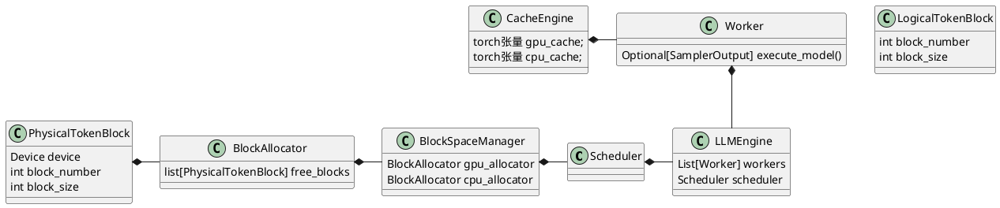

# VLLM

vllm分享

vllm 本地跑不起来，cuda版本配不上pytorch

安装cuda需要管理员权限

等搜推那边开权限给镜像，先看源码

# 相关概念

## 1.1 [Transform](https://cloud.tencent.com/developer/article/1745002)

点击展开内容

到底是怎么从输入得到输出的？解码层好像没有用到编码层。

编码器，解码器构成。实际运算时通过编码器产生输出，经过解码器产生输出矩阵，之后进行翻译。

以翻译任务为例

结构示意图


### [输入](https://blog.csdn.net/u011630575/article/details/82894698)

输入是一个词向量，就是将一个单词转化为一个向量，最简单的就是one-hot：生成一个distinc(单词)维度的矩阵，每个单词分配一个唯一的1。通过不同位置的1来识别是哪个单词。


#### 计算过程

笼统的看，输入的矩阵都是一个个无关的词向量。进行翻译时需要将这些词进行关联，比如输入的顺序，代词如it指代的是前文哪个单词。这些都需要通过数学计算产生联系。transformer使用Self Attention实现以上的联系

以上述翻译任务为例，具体实现过程为：

随机初始化 三个矩阵$W^Q ，W^K ，W^V$ ，使用各词向量乘以$W^Q， W^K， W^V$，得到q，k，v向量。

将各个单词的q，k，v相互间进行一定的运算，则相当于获取了单词间的相互关系，这个关系是基于$W^Q ，W^K， W^V$提取出来的。

相互间计算的过程为：

1. 选取单个单词的q向量，依次乘以所有输入单词的k向量，得到score
2. 缩放score并进行softmax，转化为概率
3. 使用概率乘以各个输入单词的v向量，并相加，就得到该层的输出向量


**注意**

1. 实际计算中，上面的运算对于各个单词并没有先后关系，因此可以使用矩阵进行运算。
2. 因为信息是通过$W^Q ，W^K， W^V$进行提取，因此可以生成多个提取的数组，提取多份信息，之后进行混合。这就是**multi-head attention。**


#### 输出

输出是一组向量，每一次输出一个向量，也就是词汇表中所有单词的出现概率，最高概率就是这次输出的单词。如下依次为 i am a student <eos>


## token


## 1.2 KV Cache

大模型是每次都生成一个token，例如中文的一个词。为了保证输出句子的连贯，就需要使用之前生成的token。[在 Transformer 结构中，self-attention 中的k_proj, v_proj会将输入的每个 token 转化为一个 key 和一个 value，然后使用这些 key-value 以及当前的query对来计算下一个 token。](https://readpaper.feishu.cn/docx/EcZxdsf4uozCoixdU3NcW03snwV#:~:text=在 Transformer 结构中，self-attention 中的k_proj%2C v_proj会将输入的每个 token 转化为一个 key 和一个 value，然后使用这些 key-value 以及当前的query对来计算下一个 token。)为了避免每次都全部计算之前token的k/v_proj，将这些k/v_proj进行存储，就形成了KV Cache。

生成示例

诸如：

input: 写一首诗：

在解码过程中：

output: 轻

input: 写一首诗：轻

output: 舟

input: 写一首诗：轻舟

output: 已

input: 写一首诗：轻舟已

output: 过

input: 写一首诗：轻舟已过

output: 万

input: 写一首诗：轻舟已过万

output: 重

input: 写一首诗：轻舟已过万重

output: 山

完整输出：轻舟已过万重山

存储内容为每个transformer层的k、v数组。如下图所示。这些缓存就叫KV cache。


通过kv-cache能够极大的减少计算量，具体见[KV cache详解 图示，显存，计算量分析，代码](https://zhuanlan.zhihu.com/p/646577898)。

## 1.3 cuda c

cuda c本质上是带有一些拓展的c/c++，允许使用多个并行线程在gpu上执行的函数。在这里只介绍在源码中会用到的内容：

1. __shared__: 共享内存，相当于被修饰的变量可以被同一个块的所有线程同时访问，冲突时会依次进行访问。通过__syncthreads()进行同步。
2. 


# vllm是什么

llm推理加速的框架，使用pageAttention机制，避免了内存的浪费，提高了推理的性能。

# vllm的构成

vllm架构图如下所示：


vLLM采用了中心化的调度器来协调分布式的GPU的执行。KV Cache manager以分页的方式管理KV Cache。具体来说，KV cache manager通过中心化的调度器下发指令来管理位于GPU上的worker，从而管理GPU上的物理内存。

# pageAttention

## 背景

在自回归解码过程中，query会不断和cachekv进行交互做注意力机制。而FasterTransformer里面为了避免重复的数据搬运（即把新kv和历史kv concat），预先会分配出 max_seq_len 长度的kv cache，后续只需要往里面写入即可，节省了昂贵的数据搬运操作。

由于深度学习框架要求tensor连续存储，现存系统把一个请求的所有cache都连续存储，因此无法共享。而且由于长度未知，很多系统都简单的申请最大的长度，这就会导致内部碎片。同样是因为长度未知，即使使用动态的方式申请内存(比如类似python list的自动扩容)，也会导致大量外部碎片。

那么PageAttention正是为了改进这一点而生（当然其中一个原因也包括他的动态插入逻辑），一个query对应的CacheKV不一定需要连续的显存，**他将连续个token存储的CacheKV划分为一个block**，并且有一个block_tables维护各个query对应CacheKV是哪几个block，进而索引。

==prompt和输出加在一起叫做sequence。==

## 原理

vLLM的内存管理借鉴了操作系统虚拟内存的idea。

虚拟内存

操作系统把内存划分成固定大小的分页(page)，一个进程的虚拟内存就是一系列分页。在用户(进程)看来，它的地址空间是连续的，但实际不然。操作系统会把每个分页和物理的分页建立映射。比如一个页面32k，进程的虚拟内存是320k(实际当然远大于此，比如4GB)，也就是10个分页。目前进程在使用前3个页面，那么操作系统就会把这3个页面真正的加载到物理内存里，剩下那7个页面可能缓存在磁盘里。当进程访问第4个页面时，会发生缺页中断，然后去缓存里找到这个页面放到内存，并且建立虚拟内存和物理内存的映射。如果物理内存不够用了，操作系统也会把暂时不用的分页换到磁盘缓存里。


vLLM把一个请求的KV cache表示为一系列逻辑的KV block。比如block的大小是4，则把前4个token放在第一个逻辑block，5~8个token放在第二个逻辑block里。只有最后一个block可能没有填满，这些没有填满位置用于存放后面生成的token的KV cache。在GPU的worker里，block引擎会在GPU的DRAM(HBM而不是SRAM，不清楚的读者可以参考FlashAttention)里申请和管理一块连续的空间，并且把这些空间切分成物理的KV block来实际存放一个逻辑block(为了能缓存，也会在CPU内存里申请一块内存)。KV block manager也会维护block table——它记录逻辑KV block和物理KV block的映射。

## 计算示例


1. 

首先看图中标有序号①的内容。和操作系统的虚拟内存一样，vLLM不需要为请求预留(最大的)内存，它只保留当前生成的所以KV cache。在上图的例子里，prompt有7个token，因此vLLM把前两个逻辑KV block(0和1)映射到两个物理block(7和1)。在生成的第一个阶段，vLLM一次输入7个token，得到7个token的KV cache。这一步使用的是普通的Attention算法(不需要PagedAttention)。前4个token的cache放到第一个逻辑block，接下来3个token放到第二个逻辑block，第二个逻辑block还空了一个位置，这可以用于下一个生成的输出token。

2. 

接着是自回归解码，生成新的token “fathers”，这个时候第二个逻辑block填充的数量从3变成4(满了)。

3. 

接着第二次自回归解码，生成”brought”，因为第二个逻辑块满了所以在block table新建一项，并且用物理block 3来真正存储它，同时block的filled=1。

## copy on write（并行采样）


对于同一个prompt，我们可能会在每一步生成token时不只是选择概率最大的，而是选择多个token。由于两个结果的prompt是相同的，因此KV cache可以共享。为了实现共享，我们在block table里的每个block里增加一个引用计数，比如这里的第7个物理block和第1个物理block都映射到两个逻辑block。现在假设第1个sample先执行，那么它需要在物理block1写入token “father”，因为这个物理block被多于1个人用到，所以vLLM把block1复制一份到物理block3，然后修改sample1的映射为block3，然后再把”father”的cache写入，同时减少block1的引用计数。接着第2个sample执行，这个时候block1的引用计数为1，也就是它独享，所以可以放心写入。这就是所谓的CopyOnWrite机制——也就是多个使用者共享一个资源，大家可以共享读，但是如果某人要写，那么它就需要Copy一份，然后在它自己的那份上修改。

# 源码

[VLLM推理流程梳理](https://blog.csdn.net/just_sort/article/details/132115735)





## 类图


## 推理流程

首先看常用的推理脚本

```
from vllm import LLM, SamplingParams

# Sample prompts.
prompts = [
    "Hello, my name is",
    "The president of the United States is",
    "The capital of France is",
    "The future of AI is",
]
# Create a sampling params object.
sampling_params = SamplingParams(temperature=0.8, top_p=0.95)

# Create an LLM.
llm = LLM(model="facebook/opt-125m")
# Generate texts from the prompts. The output is a list of RequestOutput objects
# that contain the prompt, generated text, and other information.
outputs = llm.generate(prompts, sampling_params)
# Print the outputs.
for output in outputs:
    prompt = output.prompt
    generated_text = output.outputs[0].text
    print(f"Prompt: {prompt!r}, Generated text: {generated_text!r}")
```

可以看到vllm的使用比较简单，通过LLM初始化后调用generate就可以进行推理。

首先看下LLM初始化，可以看出最后调用的是LLMEngine的初始化。

其中涉及到3个类，分别为LLM，EngineArgs，LLMEngine

```
class LLM:
    def __init__(
        self,
        model: str,
        tokenizer: Optional[str] = None,
        tokenizer_mode: str = "auto",
        trust_remote_code: bool = False,
        tensor_parallel_size: int = 1,
        dtype: str = "auto",
        quantization: Optional[str] = None,
        revision: Optional[str] = None,
        tokenizer_revision: Optional[str] = None,
        seed: int = 0,
        gpu_memory_utilization: float = 0.9,
        swap_space: int = 4,
        enforce_eager: bool = False,
        max_context_len_to_capture: int = 8192,
        **kwargs,
    ) -> None:
        if "disable_log_stats" not in kwargs:
            kwargs["disable_log_stats"] = True
        engine_args = EngineArgs(
            model=model,
            tokenizer=tokenizer,
            tokenizer_mode=tokenizer_mode,
            trust_remote_code=trust_remote_code,
            tensor_parallel_size=tensor_parallel_size,
            dtype=dtype,
            quantization=quantization,
            revision=revision,
            tokenizer_revision=tokenizer_revision,
            seed=seed,
            gpu_memory_utilization=gpu_memory_utilization,
            swap_space=swap_space,
            enforce_eager=enforce_eager,
            max_context_len_to_capture=max_context_len_to_capture,
            **kwargs,
        )
        self.llm_engine = LLMEngine.from_engine_args(engine_args)
        self.request_counter = Counter()
```

其中LLMEngine做了初始化tokenizer，创建并行的worker信息以及初始化KV Cache等事情，这里的worker是每个GPU对应一个。

```
class LLMEngine:
    """这段代码定义了一个名为 LLMEngine 的类，它是一个接收请求并生成文本的语言模型(LLM)引擎。
	  
	  这个类是vLLM引擎的主要类，它从客户端接收请求，并从LLM生成文本。
	  这个类包含了一个分词器，一个语言模型（可能在多个GPU之间切分），
	  以及为中间状态（也称为KV缓存）分配的GPU内存空间。
	  此类使用了迭代级别的调度和有效的内存管理来最大化服务吞吐量。

    LLM 类将此类封装用于离线批量推理，而 AsyncLLMEngine 类将此类封装用于在线服务

    注意：配置参数源自 EngineArgs 类。有关参数的完整列表，请参见 EngineArgs。

    Args:
        model_config: 与LLM模型相关的配置。
        cache_config: 与KV缓存内存管理相关的配置。
        parallel_config: 与分布式执行相关的配置。
        scheduler_config: 与分布式执行相关的配置。
        distributed_init_method: 分布式执行的初始化方法，参见torch.distributed.init_process_group了解详情。
        stage_devices: 每个stage的设备列表. 每个stage都是一个(rank, node_resource, device)元组.
        log_stats: 是否记录统计数据。
    """

    def __init__(
        self,
        model_config: ModelConfig,
        cache_config: CacheConfig,
        parallel_config: ParallelConfig,
        scheduler_config: SchedulerConfig,
        distributed_init_method: str,
        placement_group: Optional["PlacementGroup"],
        log_stats: bool,
    ) -> None:
        logger.info(
            "Initializing an LLM engine with config: "
            f"model={model_config.model!r}, "
            f"tokenizer={model_config.tokenizer!r}, "
            f"tokenizer_mode={model_config.tokenizer_mode}, "
            f"trust_remote_code={model_config.trust_remote_code}, "
            f"dtype={model_config.dtype}, "
            f"use_dummy_weights={model_config.use_dummy_weights}, "
            f"download_dir={model_config.download_dir!r}, "
            f"use_np_weights={model_config.use_np_weights}, "
            f"tensor_parallel_size={parallel_config.tensor_parallel_size}, "
            f"seed={model_config.seed})")
        # TODO(woosuk): Print more configs in debug mode.

        self.model_config = model_config
        self.cache_config = cache_config
        self.parallel_config = parallel_config
        self.scheduler_config = scheduler_config
        self.log_stats = log_stats
        self._verify_args()
        
        # 设置tokenizer
        self.tokenizer = get_tokenizer(
            model_config.tokenizer,
            tokenizer_mode=model_config.tokenizer_mode,
            trust_remote_code=model_config.trust_remote_code)
        self.seq_counter = Counter()
				
		# 对于每个 device（也即每张卡 / 每个 rank）创建一个 Worker。
		# Worker 是运行 model 的单位。一个 Engine 管理所有的 workers。
        # Create the parallel GPU workers.
        if self.parallel_config.worker_use_ray:
            self._init_workers_ray(placement_group)
        else:
            self._init_workers(distributed_init_method)
			 
			 # 初始化这个 engine 的 KV cache。
        # Profile the memory usage and initialize the cache.
        self._init_cache()

        # Create the scheduler.
        self.scheduler = Scheduler(scheduler_config, cache_config)

        # Logging.
        self.last_logging_time = 0.0
        # List of (timestamp, num_tokens)
        self.num_prompt_tokens: List[Tuple[float, int]] = []
        # List of (timestamp, num_tokens)
        self.num_generation_tokens: List[Tuple[float, int]] = []
```

其中本文关注的是pageAttention，所以这里着重看一下kv cache的初始化

```
# _init_cache函数是LLMEngine类的一个私有方法，不接受任何参数，没有返回值。
# 其目标是测量内存使用并初始化KV（键值）Cache。
def _init_cache(self) -> None:
    """Profiles the memory usage and initializes the KV cache."""
    # Get the maximum number of blocks that can be allocated on GPU and CPU.
    # 使用_run_workers方法来获取可以在GPU和CPU上分配的最大块数量。
    # _run_workers函数执行的方法是profile_num_available_blocks，并且提供了如块大小、
    # GPU内存使用率和CPU交换空间等参数，所有这些参数都是从cache_config对象中提取出来的。
    num_blocks = self._run_workers(
        "profile_num_available_blocks",
        get_all_outputs=True,
        block_size=self.cache_config.block_size,
        gpu_memory_utilization=self.cache_config.gpu_memory_utilization,
        cpu_swap_space=self.cache_config.swap_space_bytes,
    )

    # 找到所有workers中可用块的最小值，以确保所有的内存操作都可以应用到所有worker。
    # 在这个步骤中，函数分别计算了GPU和CPU的块数量。
    num_gpu_blocks = min(b[0] for b in num_blocks)
    num_cpu_blocks = min(b[1] for b in num_blocks)
    # FIXME(woosuk): Change to debug log.
    logger.info(f"# GPU blocks: {num_gpu_blocks}, "
                f"# CPU blocks: {num_cpu_blocks}")

    # 如果GPU的块数量小于等于0，函数将抛出一个值错误。
    # 这是为了确保在初始化引擎时，为缓存块提供足够的可用内存。
    if num_gpu_blocks <= 0:
        raise ValueError("No available memory for the cache blocks. "
                         "Try increasing `gpu_memory_utilization` when "
                         "initializing the engine.")
    
    # 根据计算的块数量，更新cache_config对象的num_gpu_blocks和num_cpu_blocks属性。
    self.cache_config.num_gpu_blocks = num_gpu_blocks
    self.cache_config.num_cpu_blocks = num_cpu_blocks

    # Initialize the cache.
    # 使用_run_workers方法初始化缓存。此步骤中的_run_workers执行的方法
    # 是init_cache_engine，并且提供了cache_config对象作为参数。
    self._run_workers("init_cache_engine", cache_config=self.cache_config)
```

调用init_cache_engine进行初始化，返回CacheEngine，底层调用allocate_gpu_cache与allocate_cpu_cache分别初始化gpu和cpu的cache

```
    def allocate_gpu_cache(self) -> List[KVCache]:
        gpu_cache: List[KVCache] = []
        key_block_shape = self.get_key_block_shape()
        value_block_shape = self.get_value_block_shape()
        for _ in range(self.num_layers):
            key_blocks = torch.empty(
                size=(self.num_gpu_blocks, *key_block_shape),
                dtype=self.dtype,
                device="cuda",
            )
            value_blocks = torch.empty(
                size=(self.num_gpu_blocks, *value_block_shape),
                dtype=self.dtype,
                device="cuda",
            )
            gpu_cache.append((key_blocks, value_blocks))
        return gpu_cache
    def allocate_cpu_cache(self) -> List[KVCache]:
        cpu_cache: List[KVCache] = []
        key_block_shape = self.get_key_block_shape()
        value_block_shape = self.get_value_block_shape()
        pin_memory = not in_wsl()
        if not pin_memory:
            # Pinning memory in WSL is not supported.
            # https://docs.nvidia.com/cuda/wsl-user-guide/index.html#known-limitations-for-linux-cuda-applications
            logger.warning("Using 'pin_memory=False' as WSL is detected. "
                           "This may slow down the performance.")
        for _ in range(self.num_layers):
            key_blocks = torch.empty(
                size=(self.num_cpu_blocks, *key_block_shape),
                dtype=self.dtype,
                pin_memory=pin_memory,
            )
            value_blocks = torch.empty(
                size=(self.num_cpu_blocks, *value_block_shape),
                dtype=self.dtype,
                pin_memory=pin_memory,
            )
            cpu_cache.append((key_blocks, value_blocks))
        return cpu_cache
```

回到generate

```
# generate 函数是用于根据给定的prompts生成完整文本的核心方法。
def generate(
    self,
    prompts: Optional[Union[str, List[str]]] = None,
    sampling_params: Optional[SamplingParams] = None,
    prompt_token_ids: Optional[List[List[int]]] = None,
    use_tqdm: bool = True,
) -> List[RequestOutput]:
    """Generates the completions for the input prompts.

    NOTE: This class automatically batches the given prompts, considering
    the memory constraint. For the best performance, put all of your prompts
    into a single list and pass it to this method.

    Args:
        prompts: A list of prompts to generate completions for.
        sampling_params: The sampling parameters for text generation. If
            None, we use the default sampling parameters.
        prompt_token_ids: A list of token IDs for the prompts. If None, we
            use the tokenizer to convert the prompts to token IDs.
        use_tqdm: Whether to use tqdm to display the progress bar.

    Returns:
        A list of `RequestOutput` objects containing the generated
        completions in the same order as the input prompts.
    """
    # 这段代码确保至少提供了prompts或prompts的token ID之一。
    if prompts is None and prompt_token_ids is None:
        raise ValueError("Either prompts or prompt_token_ids must be "
                         "provided.")
    # 如果只提供了一个字符串prompts（而不是列表），这段代码将其转换为列表，以便后续处理。
    if isinstance(prompts, str):
        # Convert a single prompt to a list.
        prompts = [prompts]
    # 如果同时提供了prompts和prompts token ID，则此代码确保它们的长度相同。
    if prompts is not None and prompt_token_ids is not None:
        if len(prompts) != len(prompt_token_ids):
            raise ValueError("The lengths of prompts and prompt_token_ids "
                             "must be the same.")
    # 如果未提供采样参数，此代码将使用默认参数。
    if sampling_params is None:
        # Use default sampling params.
        sampling_params = SamplingParams()

    # Add requests to the engine.
    # 此段代码循环遍历prompts或prompt token IDs，并使用它们调用 _add_request 方法
    # 将请求添加到引擎。根据是否提供了prompts或token ID，适当地处理了参数。
    if prompts is not None:
        num_requests = len(prompts)
    else:
        num_requests = len(prompt_token_ids)
    for i in range(num_requests):
        prompt = prompts[i] if prompts is not None else None
        if prompt_token_ids is None:
            token_ids = None
        else:
            token_ids = prompt_token_ids[i]
        self._add_request(prompt, sampling_params, token_ids)
    # 此代码调用先前定义的 _run_engine 方法来运行引擎，并返回其输出。
    # 这些输出是一个RequestOutput对象的列表，包含生成的完整文本，与输入prompt的顺序相同。
    return self._run_engine(use_tqdm)
```

底层调用execute_model()

cache_swap()会将需要的cache数据传入gpu

```
    @torch.inference_mode()
    def execute_model(
        self,
        seq_group_metadata_list: Optional[List[SequenceGroupMetadata]] = None,
        blocks_to_swap_in: Optional[Dict[int, int]] = None,
        blocks_to_swap_out: Optional[Dict[int, int]] = None,
        blocks_to_copy: Optional[Dict[int, List[int]]] = None,
    ) -> Optional[SamplerOutput]:
        if self.is_driver_worker:
            assert seq_group_metadata_list is not None
            num_seq_groups = len(seq_group_metadata_list)
            assert blocks_to_swap_in is not None
            assert blocks_to_swap_out is not None
            assert blocks_to_copy is not None
            data = {
                "num_seq_groups": num_seq_groups,
                "blocks_to_swap_in": blocks_to_swap_in,
                "blocks_to_swap_out": blocks_to_swap_out,
                "blocks_to_copy": blocks_to_copy,
            }
            broadcast_tensor_dict(data, src=0)
        else:
            data = broadcast_tensor_dict(src=0)
            num_seq_groups = data["num_seq_groups"]
            blocks_to_swap_in = data["blocks_to_swap_in"]
            blocks_to_swap_out = data["blocks_to_swap_out"]
            blocks_to_copy = data["blocks_to_copy"]

        self.cache_swap(blocks_to_swap_in, blocks_to_swap_out, blocks_to_copy)

        # If there is no input, we don't need to execute the model.
        if num_seq_groups == 0:
            return {}

        output = self.model_runner.execute_model(seq_group_metadata_list,
                                                 self.gpu_cache)
        return output
@torch.inference_mode()
    def execute_model(
        self,
        seq_group_metadata_list: Optional[List[SequenceGroupMetadata]],
        kv_caches: List[Tuple[torch.Tensor, torch.Tensor]],
    ) -> Optional[SamplerOutput]:
        input_tokens, input_positions, input_metadata, sampling_metadata = (
            self.prepare_input_tensors(seq_group_metadata_list))
        # Execute the model.
        if input_metadata.use_cuda_graph:
            graph_batch_size = input_tokens.shape[0]
            model_executable = self.graph_runners[graph_batch_size]
        else:
            model_executable = self.model
				// model为nn.Module，直接调用相当于调用forward
        hidden_states = model_executable(
            input_ids=input_tokens,
            positions=input_positions,
            kv_caches=kv_caches,
            input_metadata=input_metadata,
        )

        # Sample the next token.
        output = self.model.sample(
            hidden_states=hidden_states,
            sampling_metadata=sampling_metadata,
        )
        return output
```

execute_model调用model.eval()，其中关于加载model的代码如下，之后主要看的就是各个class的实现，以下以百川为例。

```
def load_model(self) -> None:
self.model = get_model(self.model_config)

def get_model(model_config: ModelConfig) -> nn.Module:
    model_class = _get_model_architecture(model_config.hf_config)

    # Get the (maybe quantized) linear method.
    linear_method = None
    if model_config.quantization is not None:
        quant_config = get_quant_config(model_config.quantization,
                                        model_config.model,
                                        model_config.hf_config,
                                        model_config.download_dir)
        capability = torch.cuda.get_device_capability()
        capability = capability[0] * 10 + capability[1]
        if capability < quant_config.get_min_capability():
            raise ValueError(
                f"The quantization method {model_config.quantization} is not "
                "supported for the current GPU. "
                f"Minimum capability: {quant_config.get_min_capability()}. "
                f"Current capability: {capability}.")
        supported_dtypes = quant_config.get_supported_act_dtypes()
        if model_config.dtype not in supported_dtypes:
            raise ValueError(
                f"{model_config.dtype} is not supported for quantization "
                f"method {model_config.quantization}. Supported dtypes: "
                f"{supported_dtypes}")
        linear_method = quant_config.get_linear_method()

    with _set_default_torch_dtype(model_config.dtype):
        # Create a model instance.
        # The weights will be initialized as empty tensors.
        with torch.device("cuda"):
            model = model_class(model_config.hf_config, linear_method)
        if model_config.load_format == "dummy":
            # NOTE(woosuk): For accurate performance evaluation, we assign
            # random values to the weights.
            initialize_dummy_weights(model)
        else:
            # Load the weights from the cached or downloaded files.
            model.load_weights(model_config.model, model_config.download_dir,
                               model_config.load_format, model_config.revision)
    return model.eval()
```

总结一下大致流程

首先，vllm进来之后先实例化一个LLM对象即：llm = LLM(model="facebook/opt-125m")。然后调用llm.generate函数，这个函数的输入是prompts（List[str]类型），采样参数，然后返回 List[RequestOutput]，对应outputs = llm.generate(prompts, sampling_params)这行代码。从llm.generate的实现来看，对于每一个prompt都会生成一个request喂给llm_engine，然后执行_run_engine（这个函数负责运行 llm_engine.step函数，并收集已完成的请求的输出。）函数结束。

### 百川大模型推理

大模型定义

```
class BaiChuanModel(nn.Module):

    def __init__(self,
                 config: BaiChuanConfig,
                 position_embedding: str,
                 linear_method: Optional[LinearMethodBase] = None):
        super().__init__()
        self.config = config
        self.padding_idx = config.pad_token_id
        self.vocab_size = config.vocab_size

        self.embed_tokens = VocabParallelEmbedding(
            config.vocab_size,
            config.hidden_size,
        )
        self.layers = nn.ModuleList([
            BaiChuanDecoderLayer(config, position_embedding, linear_method)
            for _ in range(config.num_hidden_layers)
        ])
        self.norm = RMSNorm(config.hidden_size, eps=config.rms_norm_eps)
		// 上面调用的为本方法
    def forward(
        self,
        input_ids: torch.Tensor,
        positions: torch.Tensor,
        kv_caches: List[KVCache],
        input_metadata: InputMetadata,
    ) -> torch.Tensor:
        hidden_states = self.embed_tokens(input_ids)
        residual = None
        for i in range(len(self.layers)):
            layer = self.layers[i]
            hidden_states, residual = layer(
                positions,
                hidden_states,
                kv_caches[i],
                input_metadata,
                residual,
            )
        hidden_states, _ = self.norm(hidden_states, residual)
        return hidden_states
```

可以看到init后初始化了多个解码器，同时关注kv_cache，最后可以追溯到PagedAttention(nn.Module):

关注其forward

#### 解码

```
    def forward(
        self,
        query: torch.Tensor,
        key: torch.Tensor,
        value: torch.Tensor,
        key_cache: Optional[torch.Tensor],
        value_cache: Optional[torch.Tensor],
        input_metadata: InputMetadata,
    ) -> torch.Tensor:
        """PagedAttention forward pass.

        Args:
            query: shape = [batch_size, seq_len, num_heads * head_size]
            key: shape = [batch_size, seq_len, num_kv_heads * head_size]
            value: shape = [batch_size, seq_len, num_kv_heads * head_size]
            key_cache: shape = [num_blocks, num_kv_heads, head_size/x,
                block_size, x]
            value_cache: shape = [num_blocks, num_kv_heads, head_size,
                block_size]
            input_metadata: metadata for the inputs.
        Returns:
            shape = [batch_size, seq_len, num_heads * head_size]
        """
        batch_size, seq_len, hidden_size = query.shape
        # Reshape the query, key, and value tensors.
        query = query.view(-1, self.num_heads, self.head_size)
        key = key.view(-1, self.num_kv_heads, self.head_size)
        value = value.view(-1, self.num_kv_heads, self.head_size)

        # Reshape the keys and values and store them in the cache.
        # If key_cache and value_cache are not provided, the new key and value
        # vectors will not be cached. This happens during the initial memory
        # profiling run.
        if key_cache is not None and value_cache is not None:
            cache_ops.reshape_and_cache(
                key,
                value,
                key_cache,
                value_cache,
                input_metadata.slot_mapping.flatten(),
            )

        if input_metadata.is_prompt:
            # Prompt run.
            if self.num_kv_heads != self.num_heads:
                # As of Nov 2023, xformers only supports MHA. For MQA/GQA,
                # project the key and value tensors to the desired number of
                # heads.
                # TODO(woosuk): Use MQA/GQA kernels for higher performance.
                query = query.view(query.shape[0], self.num_kv_heads,
                                   self.num_queries_per_kv, query.shape[-1])
                key = key[:, :,
                          None, :].expand(key.shape[0], self.num_kv_heads,
                                          self.num_queries_per_kv,
                                          key.shape[-1])
                value = value[:, :, None, :].expand(value.shape[0],
                                                    self.num_kv_heads,
                                                    self.num_queries_per_kv,
                                                    value.shape[-1])
            # normal attention
            if (key_cache is None or value_cache is None
                    or input_metadata.block_tables.numel() == 0):
                # Set attention bias if not provided. This typically happens at
                # the very attention layer of every iteration.
                # FIXME(woosuk): This is a hack.
                if input_metadata.attn_bias is None:
                    if self.alibi_slopes is None:
                        attn_bias = BlockDiagonalCausalMask.from_seqlens(
                            [seq_len] * batch_size)
                        if self.sliding_window is not None:
                            attn_bias = attn_bias.make_local_attention(
                                self.sliding_window)
                        input_metadata.attn_bias = attn_bias
                    else:
                        input_metadata.attn_bias = _make_alibi_bias(
                            self.alibi_slopes, self.num_kv_heads, batch_size,
                            seq_len, query.dtype)

                # TODO(woosuk): Too many view operations. Let's try to reduce
                # them in the future for code readability.
                if self.alibi_slopes is None:
                    query = query.unsqueeze(0)
                    key = key.unsqueeze(0)
                    value = value.unsqueeze(0)
                else:
                    query = query.unflatten(0, (batch_size, seq_len))
                    key = key.unflatten(0, (batch_size, seq_len))
                    value = value.unflatten(0, (batch_size, seq_len))

                out = xops.memory_efficient_attention_forward(
                    query,
                    key,
                    value,
                    attn_bias=input_metadata.attn_bias,
                    p=0.0,
                    scale=self.scale,
                    op=xops.fmha.MemoryEfficientAttentionFlashAttentionOp[0] if
                    (is_hip()) else None,
                )
                output = out.view_as(query)
            else:
                # prefix-enabled attention
                output = torch.empty_like(query)
                context_attention_fwd(
                    query,
                    key,
                    value,
                    output,
                    key_cache,
                    value_cache,
                    input_metadata.block_tables,  # [BS, max_block_per_request]
                    input_metadata.start_loc,
                    input_metadata.prompt_lens,
                    input_metadata.context_lens,
                    input_metadata.max_seq_len,
                    getattr(self, "alibi_slopes", None),
                )

        else:
            # Decoding run.
            output = _paged_attention(
                query,
                key_cache,
                value_cache,
                input_metadata,
                self.num_kv_heads,
                self.scale,
                self.alibi_slopes,
            )

        # Reshape the output tensor.
        return output.view(batch_size, seq_len, hidden_size)
void reshape_and_cache(
  torch::Tensor& key,           // [num_tokens, num_heads, head_size]
  torch::Tensor& value,         // [num_tokens, num_heads, head_size]
  torch::Tensor& key_cache,     // [num_blocks, num_heads, head_size/x, block_size, x]
  torch::Tensor& value_cache,   // [num_blocks, num_heads, head_size, block_size]
  torch::Tensor& slot_mapping)  // [num_tokens]
{
  int num_tokens = key.size(0);
  int num_heads = key.size(1);
  int head_size = key.size(2);
  int block_size = key_cache.size(3);
  int x = key_cache.size(4);

  int key_stride = key.stride(0);
  int value_stride = value.stride(0);

  dim3 grid(num_tokens);
  dim3 block(std::min(num_heads * head_size, 512));
  const at::cuda::OptionalCUDAGuard device_guard(device_of(key));
  const cudaStream_t stream = at::cuda::getCurrentCUDAStream();
  VLLM_DISPATCH_FLOATING_TYPES(
    key.scalar_type(),
    "reshape_and_cache_kernel",
    [&] {
      vllm::reshape_and_cache_kernel<scalar_t><<<grid, block, 0, stream>>>(
        key.data_ptr<scalar_t>(),
        value.data_ptr<scalar_t>(),
        key_cache.data_ptr<scalar_t>(),
        value_cache.data_ptr<scalar_t>(),
        slot_mapping.data_ptr<int64_t>(),
        key_stride,
        value_stride,
        num_heads,
        head_size,
        block_size,
        x);
    });
}
```

#### pageAttention底层调用

paged_attention_v1_launcher中对于kv_cache的使用就是通过指针进行获取

```
  T* key_cache_ptr = reinterpret_cast<T*>(key_cache.data_ptr());
  T* value_cache_ptr = reinterpret_cast<T*>(value_cache.data_ptr());
```

## BlockSpaceManager和CacheEngine间的联系

一个是在主节点上进行内存管理，一个是远程worker中的内存管理，为实际进行内存操作的载体。

相互间交互：


**BlockSpaceManager**

内部只是一个dict，记录block分配情况。

**CacheEngine**

实际进行存储操作，通过**BlockSpaceManager**记录的block情况，从而对gpu的内存进行实际的操作。在execute_model()中使用。

int64_t src_offset = src_block_number * block_size_in_bytes;

int64_t dst_offset = dst_block_number * block_size_in_bytes;

```
void swap_blocks(
  torch::Tensor& src,
  torch::Tensor& dst,
  const std::map<int64_t, int64_t>& block_mapping) {
  torch::Device src_device = src.device();
  torch::Device dst_device = dst.device();
  cudaMemcpyKind memcpy_type;
  if (src_device.is_cuda() && dst_device.is_cuda()) {
    TORCH_CHECK(
      src_device.index() == dst_device.index(),
      "src and dst must be on the same GPU");
    memcpy_type = cudaMemcpyDeviceToDevice;
  } else if (src_device.is_cuda() && dst_device.is_cpu()) {
    memcpy_type = cudaMemcpyDeviceToHost;
  } else if (src_device.is_cpu() && dst_device.is_cuda()) {
    memcpy_type = cudaMemcpyHostToDevice;
  } else {
    TORCH_CHECK(false, "Invalid device combination");
  }

  char *src_ptr = static_cast<char*>(src.data_ptr());
  char *dst_ptr = static_cast<char*>(dst.data_ptr());

  const int64_t block_size_in_bytes = src.element_size() * src[0].numel();
  const at::cuda::OptionalCUDAGuard device_guard(src_device);
  const cudaStream_t stream = at::cuda::getCurrentCUDAStream();
  // NOTE(woosuk): This can be slow if the number of blocks is large.
  for (const auto& pair : block_mapping) {
    int64_t src_block_number = pair.first;
    int64_t dst_block_number = pair.second;
    int64_t src_offset = src_block_number * block_size_in_bytes;
    int64_t dst_offset = dst_block_number * block_size_in_bytes;
    cudaMemcpyAsync(
      dst_ptr + dst_offset,
      src_ptr + src_offset,
      block_size_in_bytes,
      memcpy_type,
      stream);
  }
}
```

## cache engine

上面的实现和普通的PyTorch执行模型前向最大的一个区别是它维护了一个cache engine，它是用来管理模型的KV Cache的。下面是对它的实现进行解析，它的实现在vllm/vllm/worker/cache_engine.py这个文件。

## Scheduler

首先解析一下vllm/vllm/core/目录下的policy.py和block_manager.py，它们分别负责实现Scheduler的队列中的优先法则以及KV Cache块的管理过程，并且实现都非常简单和简短。

1. 队列优先

先到先得

```
# 这是一个抽象的策略类。
class Policy:
    # 计算一个 SequenceGroup 的优先级。子类需要重写这个方法来提供具体的优先级计算逻辑。
    def get_priority(
        self,
        now: float,
        seq_group: SequenceGroup,
    ) -> float:
        raise NotImplementedError

    # 根据优先级对一组 SequenceGroup 进行排序。这是一个通用方法，使用了前面的 get_priority() 方法。
    def sort_by_priority(
        self,
        now: float,
        seq_groups: List[SequenceGroup],
    ) -> List[SequenceGroup]:
        return sorted(
            seq_groups,
            key=lambda seq_group: self.get_priority(now, seq_group),
            reverse=True,
        )

# 这是 Policy 的一个具体子类，它实现了先到先得（First-Come-First-Serve, FCFS）的调度策略。
# 它重写了 get_priority() 方法，以便为每个 SequenceGroup 分配一个与其到达时间相关的优先级。
# 此处，优先级是当前时间减去序列组的到达时间，这意味着越早到达的 SequenceGroup 优先级越高。
class FCFS(Policy):

    def get_priority(
        self,
        now: float,
        seq_group: SequenceGroup,
    ) -> float:
        return now - seq_group.arrival_time

# 这是一个工厂类，用于创建和返回特定的策略对象。它使用一个名为 _POLICY_REGISTRY 
# 的字典来注册策略类，其中键是策略的名称（如 'fcfs'），值是相应的策略类。
class PolicyFactory:

    _POLICY_REGISTRY = {
        'fcfs': FCFS,
    }
    
    # get_policy(): 是一个类方法，它接受策略名称作为参数，
    # 查找 _POLICY_REGISTRY 字典并返回对应的策略对象实例。
    @classmethod
    def get_policy(cls, policy_name: str, **kwargs) -> Policy:
        return cls._POLICY_REGISTRY[policy_name](**kwargs)
```

2. 块管理

大致内容为通过维护一个空闲block队列，通过这个队列的pop和push进行块的分配与释放。

```
"""A block manager that manages token blocks."""
from typing import Dict, List, Optional, Set, Tuple

from vllm.block import PhysicalTokenBlock
from vllm.sequence import Sequence, SequenceGroup, SequenceStatus
from vllm.utils import Device

# 这段代码定义了一个 BlockAllocator 类，它管理设备上的PhysicalTokenBlock的分配和释放
class BlockAllocator:
    """这个类维护了一个空闲块列表，并在请求时分配一个块。当块被释放时，它的引用计数会减少。
    当引用计数变为零时，该块会被重新添加到空闲列表中。
    """

    # 这是类的初始化方法，当创建 BlockAllocator 的实例时，它会被调用。
    # 方法接受三个参数：设备 (device)、块大小 (block_size) 和块数 (num_blocks)。
    # 这三个参数分别保存在类的属性中。
    def __init__(
        self,
        device: Device,
        block_size: int,
        num_blocks: int,
    ) -> None:
        self.device = device
        self.block_size = block_size
        self.num_blocks = num_blocks

        # Initialize the free blocks.
        # 这段代码初始化了空闲块列表。它为每个块创建了一个 PhysicalTokenBlock 实例，
        # 并添加到 free_blocks 列表中。
        self.free_blocks: List[PhysicalTokenBlock] = []
        for i in range(num_blocks):
            block = PhysicalTokenBlock(device=device,
                                       block_number=i,
                                       block_size=block_size)
            self.free_blocks.append(block)

    # 这个方法用于分配一个空闲的PhysicalTokenBlock。如果没有可用的空闲块，
    # 它会引发一个值错误。分配的块的引用计数被设置为1。
    def allocate(self) -> PhysicalTokenBlock:
        if not self.free_blocks:
            raise ValueError("Out of memory! No free blocks are available.")
        block = self.free_blocks.pop()
        block.ref_count = 1
        return block

    # 这个方法释放一个先前分配的块。如果块的引用计数已经是0，它会引发一个值错误，
    # 因为这意味着块已经被释放。块的引用计数减少，如果引用计数变为零，块被重新添加到空闲列表中。
    def free(self, block: PhysicalTokenBlock) -> None:
        if block.ref_count == 0:
            raise ValueError(f"Double free! {block} is already freed.")
        block.ref_count -= 1
        if block.ref_count == 0:
            self.free_blocks.append(block)

    # 这个方法返回当前可用的空闲块的数量。
    def get_num_free_blocks(self) -> int:
        return len(self.free_blocks)


# Mapping: logical block number -> physical block.
BlockTable = List[PhysicalTokenBlock]

# BlockTable 是一个类型别名，表示的是从逻辑块号映射到物理块的列表。
class BlockSpaceManager:
    """Manages the mapping between logical and physical token blocks."""

    # 这是类的初始化方法，它接受四个参数：块大小 (block_size)、GPU上的块数 (num_gpu_blocks)、
    # CPU上的块数 (num_cpu_blocks) 和一个水印值 (watermark)。
    # 水印是一个比例，用于确定当GPU块数量低于这个水印值时可能需要采取的措施。
    def __init__(
        self,
        block_size: int,
        num_gpu_blocks: int,
        num_cpu_blocks: int,
        watermark: float = 0.01,
    ) -> None:
        # 这段代码初始化了类的属性，并确保提供的水位值是非负的。
        self.block_size = block_size
        self.num_total_gpu_blocks = num_gpu_blocks
        self.num_total_cpu_blocks = num_cpu_blocks
        self.watermark = watermark
        assert watermark >= 0.0

        # 首先，基于给定的水位值和GPU上的块数，计算出一个整数值的水位块数。
        # 然后，为GPU和CPU初始化块分配器。
        self.watermark_blocks = int(watermark * num_gpu_blocks)
        self.gpu_allocator = BlockAllocator(Device.GPU, block_size,
                                            num_gpu_blocks)
        self.cpu_allocator = BlockAllocator(Device.CPU, block_size,
                                            num_cpu_blocks)
        # Mapping: seq_id -> BlockTable.
        # 这里初始化了一个块映射表，它是一个字典，其键是序列ID (seq_id)，
        # 值是上面定义的 BlockTable 类型。这个字典将帮助我们跟踪每个序列ID与哪些物理块相关联。
        self.block_tables: Dict[int, BlockTable] = {}

    # can_allocate 函数接受一个参数 seq_group（类型为 SequenceGroup）并返回一个布尔值。
    def can_allocate(self, seq_group: SequenceGroup) -> bool:
        # 此注释标识了一个潜在的问题或假设。该注释提到在当前实现中，我们假设在 seq_group 
        # 中的所有序列共享相同的提示（prompt）。但是，这个假设可能对于被preempted的序列并不成立。
        # 由于这是一个 FIXME 注释，它意味着这个问题在未来需要被修复或重新审视。
        # FIXME(woosuk): Here we assume that all sequences in the group share
        # the same prompt. This may not be true for preempted sequences.
        # 这里，代码首先从 seq_group 中获取序列列表并选择第一个序列
        #（假设在该组中的所有序列都有相同数量的块）。然后，计算该序列所需的逻辑块数量。
        seq = seq_group.get_seqs()[0]
        num_required_blocks = len(seq.logical_token_blocks)
        # 该行代码调用 gpu_allocator（即GPU块分配器）的 get_num_free_blocks 方法，
        # 来得到当前可用的空闲GPU块数量。
        num_free_gpu_blocks = self.gpu_allocator.get_num_free_blocks()
        # Use watermark to avoid frequent cache eviction.
        # 此行代码检查当前空闲的GPU块数量是否足以满足序列的需求，
        # 并且剩余的块数量是否大于或等于水位块数量（watermark_blocks）。
        # 使用水位是为了避免频繁地清除缓存，确保始终有一定数量的块保持空闲。
        # 如果满足这些条件，函数返回 True，表示可以为 seq_group 分配所需的块；否则，返回 False。
        return (num_free_gpu_blocks - num_required_blocks >=
                self.watermark_blocks)
             
    # 这段代码定义了BlockSpaceManager类中的allocate成员函数，
    # 该函数用于为给定的seq_group分配PhysicalTokenBlock
    def allocate(self, seq_group: SequenceGroup) -> None:
        # NOTE: Here we assume that all sequences in the group have the same
        # prompt.
        # 此行从seq_group中选择了第一个序列。由于之前的注释提到所有的序列都有相同的提示，
        # 因此我们可以通过查看第一个序列来确定需要的块数量。
        seq = seq_group.get_seqs()[0]

        # Allocate new physical token blocks that will store the prompt tokens.
        # 首先，初始化一个空的block_table，用于存储分配给序列的PhysicalTokenBlock。
        # 然后，根据第一个序列的logical_token_blocks的数量进行循环，为每个logical_token_blocks分配一个PhysicalTokenBlock。
        # PhysicalTokenBlock的引用计数被设置为序列组中的序列数量。这可能意味着每个
        # PhysicalTokenBlock可以被多个序列共享。每分配一个PhysicalTokenBlock，
        # 就将其添加到block_table中。
        block_table: BlockTable = []
        for _ in range(len(seq.logical_token_blocks)):
            block = self.gpu_allocator.allocate()
            # Set the reference counts of the token blocks.
            block.ref_count = seq_group.num_seqs()
            block_table.append(block)

        # Assign the block table for each sequence.
        # 对于seq_group中的每个序列，将block_table复制并分配给该序列。
        # 这意味着，尽管每个序列都有自己的块表副本，但它们都引用同一组PhysicalTokenBlock。
        for seq in seq_group.get_seqs():
            self.block_tables[seq.seq_id] = block_table.copy()

    # 此函数是BlockSpaceManager类的一个成员函数，名为can_append_slot。
    # 它决定是否可以为给定的seq_group追加一个新的token块（slot）。
    # 函数的逻辑是基于一个简单的启发式方法：如果有足够的自由块（free blocks）
    # 来满足序列组中每个序列的需求，那么就可以追加。
    def can_append_slot(self, seq_group: SequenceGroup) -> bool:
        # Simple heuristic: If there is at least one free block
        # for each sequence, we can append.
        # 此行从gpu_allocator获取GPU上当前的空闲块数量，并将其存储在num_free_gpu_blocks变量中。
        num_free_gpu_blocks = self.gpu_allocator.get_num_free_blocks()
        # 使用num_seqs方法，函数从seq_group获取当前状态为RUNNING的序列数量。
        num_seqs = seq_group.num_seqs(status=SequenceStatus.RUNNING)
        # 函数返回一个布尔值，这个布尔值是基于一个简单的判断：
        # 如果当前RUNNING状态的序列数量num_seqs小于或等于GPU上的空闲块数量num_free_gpu_blocks，
        # 则返回True（表示可以追加新的slot），否则返回False。
        return num_seqs <= num_free_gpu_blocks

    # 这段代码定义了BlockSpaceManager类中的append_slot函数，
    # 该函数的主要目标是为一个新的token分配一个物理slot。
    def append_slot(self, seq: Sequence) -> Optional[Tuple[int, int]]:
        """Allocate a physical slot for a new token."""
        # 从输入的序列seq中提取逻辑块，并从块表中获取与该序列ID关联的块表。
        logical_blocks = seq.logical_token_blocks
        block_table = self.block_tables[seq.seq_id]

        # 如果块表的长度小于逻辑块的数量，这意味着序列有一个新的逻辑块。
        # 因此，分配一个新的物理块并将其添加到块表中。
        if len(block_table) < len(logical_blocks):
            # The sequence has a new logical block.
            # Allocate a new physical block.
            block = self.gpu_allocator.allocate()
            block_table.append(block)
            return None

        # We want to append the token to the last physical block.
        # 获取块表中的最后一个块，并确保它在GPU设备上。
        last_block = block_table[-1]
        assert last_block.device == Device.GPU
        # 如果最后一个块的引用计数为1，这意味着它不与其他序列共享，因此可以直接追加token。
        if last_block.ref_count == 1:
            # Not shared with other sequences. Appendable.
            return None
        else:
            # The last block is shared with other sequences.
            # Copy on Write: Allocate a new block and copy the tokens.
            # 如果最后一个块与其他序列共享，我们将使用“Copy on Write”策略：
            # 为新的token分配一个新的块，并复制旧块中的tokens。
            # 然后，释放旧块，并在块表中更新块的引用。
            # 函数返回旧块和新块的块编号，以便外部调用者知道哪些块已更改。
            new_block = self.gpu_allocator.allocate()
            block_table[-1] = new_block
            self.gpu_allocator.free(last_block)
            return last_block.block_number, new_block.block_number

    # 这段代码定义了BlockSpaceManager类中的fork方法，该方法的目的是为子序列创建一个块表，
    # 该表是基于其父序列的块表的副本。此函数确保每个物理块的引用计数在分叉时正确地增加，
    # 这是因为两个序列（父序列和子序列）现在共享相同的物理块。
    def fork(self, parent_seq: Sequence, child_seq: Sequence) -> None:
        # NOTE: fork does not allocate a new physical block.
        # Thus, it is always safe from OOM.
        # 从块表映射中，根据父序列的ID获取其块表。
        src_block_table = self.block_tables[parent_seq.seq_id]
        # 为子序列创建一个新的块表，这个块表是父序列块表的一个副本。这
        # 意味着父序列和子序列现在都引用相同的物理块，但是它们有各自独立的逻辑块。
        self.block_tables[child_seq.seq_id] = src_block_table.copy()
        # 由于子序列现在也引用相同的物理块，所以需要增加每个物理块的引用计数。
        # 这确保了物理块不会在它仍然被使用时被意外释放。
        for block in src_block_table:
            block.ref_count += 1

    # 这段代码定义了BlockSpaceManager类中的一个私有方法_get_physical_blocks，
    # 它的目的是获取一个SequenceGroup内部所有序列所使用的所有物理块，而没有重复。
    # 这个方法接受一个SequenceGroup对象作为参数，并返回一个PhysicalTokenBlock对象的列表。
    def _get_physical_blocks(
            self, seq_group: SequenceGroup) -> List[PhysicalTokenBlock]:
        # 这个注释提到一个关键的假设：物理块只能在同一组内的序列之间共享。
        # 这意味着不同组之间的序列不会共享相同的物理块。
        # NOTE: Here, we assume that the physical blocks are only shared by
        # the sequences in the same group.
        # 这里使用了一个集合（set）来存储物理块，因为集合不允许有重复的元素。
        # 这样可以确保，即使多个序列引用同一个物理块，该块也只会在集合中出现一次。
        blocks: Set[PhysicalTokenBlock] = set()
        # 首先，对序列组内的每个序列进行遍历。
        for seq in seq_group.get_seqs():
            # 使用seq.is_finished()来检查该序列是否已完成。如果已完成，那么我们跳过这个序列，继续下一个。
            if seq.is_finished():
                continue
            # 如果该序列没有完成，我们从self.block_tables中获取与该序列ID关联的块表。
            block_table = self.block_tables[seq.seq_id]
            # 遍历这个块表中的每个物理块，并将其添加到blocks集合中。
            # 由于使用了集合，重复的块不会被多次添加。
            for block in block_table:
                blocks.add(block)
        return list(blocks)

    # 这段代码定义了BlockSpaceManager类中的一个方法can_swap_in，
    # 这个方法的目的是确定给定的SequenceGroup是否可以被交换到GPU中。
    # 该方法接受一个SequenceGroup对象作为参数，并返回一个布尔值，
    # 表示该SequenceGroup是否可以被交换到GPU中。
    def can_swap_in(self, seq_group: SequenceGroup) -> bool:
        # 使用之前定义的_get_physical_blocks方法来获取seq_group中所有序列所使用的物理块的列表。
        blocks = self._get_physical_blocks(seq_group)
        # 计算seq_group中状态为SWAPPED的序列的数量。
        num_swapped_seqs = seq_group.num_seqs(status=SequenceStatus.SWAPPED)
        # 使用gpu_allocator来获取当前可用于GPU的空闲块的数量。
        num_free_blocks = self.gpu_allocator.get_num_free_blocks()
        # NOTE: Conservatively, we assume that every sequence will allocate
        # at least one free block right after the swap-in.
        # NOTE: This should match the logic in can_append_slot().
        # 这里的逻辑有两个关键的假设：
        # 1. 每一个被交换进来的序列都会在交换后立即分配至少一个空闲块。
        # 2. 这种分配逻辑应该与can_append_slot()中的逻辑匹配。
        # 因此，为了确定我们是否有足够的块来满足这个要求，我们需要将当前物理块的数量
        # 与SWAPPED状态的序列的数量相加
        num_required_blocks = len(blocks) + num_swapped_seqs
        # 最终的决策是基于空闲块的数量是否超过所需块的数量加上一个阈值self.watermark_blocks。
        # 如果是，则返回True，表示该SequenceGroup可以被交换到GPU中；否则，返回False。
        return num_free_blocks - num_required_blocks >= self.watermark_blocks

    # 这个函数是BlockSpaceManager类的swap_in方法，其作用是将一个序列组(seq_group)从CPU交换到GPU，
    # 并为此过程中涉及的每个CPU块与GPU块创建映射关系。
    def swap_in(self, seq_group: SequenceGroup) -> Dict[int, int]:
        # CPU block -> GPU block.
        # 这里初始化一个字典来记录从CPU块到GPU块的映射关系。
        mapping: Dict[PhysicalTokenBlock, PhysicalTokenBlock] = {}
        # 遍历SequenceGroup中的每一个序列。如果这个序列已经完成，我们就跳过它。
        for seq in seq_group.get_seqs():
            if seq.is_finished():
                continue
            # 这里我们为当前的序列初始化一个新的GPU块表。block_table是原来与这个序列关联的CPU块列表。
            new_block_table: BlockTable = []
            block_table = self.block_tables[seq.seq_id]

            # 对于每个CPU块：
            for cpu_block in block_table:
                # 我们首先检查它是否已经有一个关联的GPU块(通过mapping字典)。
                # 如果有，我们简单地增加这个GPU块的引用计数。
                if cpu_block in mapping:
                    gpu_block = mapping[cpu_block]
                    gpu_block.ref_count += 1
                else:
                    # 如果没有，则为该CPU块分配一个新的GPU块，并在mapping字典中记录这种关联。
                    gpu_block = self.gpu_allocator.allocate()
                    mapping[cpu_block] = gpu_block
                # 把新的GPU块添加到new_block_table列表中。
                new_block_table.append(gpu_block)
                # Free the CPU block swapped in to GPU.
                # 释放原来的CPU块，因为我们现在在GPU上有了一个拷贝。
                self.cpu_allocator.free(cpu_block)
            # 我们使用新的GPU块列表更新当前序列的块映射。
            self.block_tables[seq.seq_id] = new_block_table

        # 在这个方法的最后，我们创建并返回一个新的映射，这个映射使用块号
        #（而不是块对象）来表示从CPU块到GPU块的关联。这样的表示方式可能更加方便和简洁。
        block_number_mapping = {
            cpu_block.block_number: gpu_block.block_number
            for cpu_block, gpu_block in mapping.items()
        }
        return block_number_mapping

    # 这个方法是BlockSpaceManager类中的一个成员函数，其名称为can_swap_out。
    # 其作用是判断是否可以将指定的seq_group（序列组）从GPU交换出到CPU。
    def can_swap_out(self, seq_group: SequenceGroup) -> bool:
        # 首先，使用内部方法_get_physical_blocks获取序列组seq_group当前在GPU上的所有物理块。
        blocks = self._get_physical_blocks(seq_group)
        # 这里检查序列组中的物理块数量是否小于或等于CPU上的空闲块数量。
        # 这确保我们有足够的空间在CPU上容纳所有要交换的块。
        return len(blocks) <= self.cpu_allocator.get_num_free_blocks()

    # 这个swap_out方法是BlockSpaceManager类的成员函数。其核心功能是从GPU将特定的seq_group
    #（序列组）交换出到CPU。在此过程中，方法还返回一个字典，
    # 说明GPU上的块号与交换到CPU上的块号之间的映射关系。
    def swap_out(self, seq_group: SequenceGroup) -> Dict[int, int]:
        # GPU block -> CPU block.
        # 这是一个映射字典，其键是在GPU上的块，值是在CPU上的块。
        mapping: Dict[PhysicalTokenBlock, PhysicalTokenBlock] = {}
        # 为了交换整个序列组，我们遍历其中的每一个序列。
        for seq in seq_group.get_seqs():
            # 如果当前序列已经完成，则跳过该序列，继续处理下一个。
            if seq.is_finished():
                continue
            new_block_table: BlockTable = []
            block_table = self.block_tables[seq.seq_id]

            # 我们现在开始处理每一个在GPU上的块。
            for gpu_block in block_table:
                # 如果当前GPU块已经有一个映射到CPU的块，我们增加该CPU块的引用计数。
                if gpu_block in mapping:
                    cpu_block = mapping[gpu_block]
                    cpu_block.ref_count += 1
                else:
                    # 如果当前GPU块不在映射中，我们在CPU上为其分配一个新块，
                    # 并将此映射关系添加到mapping字典中。
                    cpu_block = self.cpu_allocator.allocate()
                    mapping[gpu_block] = cpu_block
                # 我们将新分配或已映射的CPU块添加到new_block_table中。
                new_block_table.append(cpu_block)
                # Free the GPU block swapped out to CPU.
                # 当一个GPU块被成功交换到CPU上后，我们释放该GPU块，使其可以被其他数据使用。
                self.gpu_allocator.free(gpu_block)
            # 我们用新的new_block_table更新当前序列的块映射。
            self.block_tables[seq.seq_id] = new_block_table

        # 最后，我们创建一个块号的映射字典，其键是GPU块号，值是CPU块号。
        block_number_mapping = {
            gpu_block.block_number: cpu_block.block_number
            for gpu_block, cpu_block in mapping.items()
        }
        return block_number_mapping

    # 这是一个私有方法（由下划线_开始，通常表示这个方法是内部方法，不应该在类的外部直接调用），
    # 名为_free_block_table，它的主要任务是释放提供的块表（block_table）中的块。
    def _free_block_table(self, block_table: BlockTable) -> None:
        for block in block_table:
            if block.device == Device.GPU:
                self.gpu_allocator.free(block)
            else:
                self.cpu_allocator.free(block)

    # 它的主要任务是释放与指定seq（一个Sequence对象）相关的资源
    def free(self, seq: Sequence) -> None:
        if seq.seq_id not in self.block_tables:
            # Already freed or haven't been scheduled yet.
            return
        block_table = self.block_tables[seq.seq_id]
        self._free_block_table(block_table)
        del self.block_tables[seq.seq_id]

    # 这个方法的目的是重置BlockSpaceManager的状态，释放所有与之相关的块，并清空block_tables字典。
    def reset(self) -> None:
        for block_table in self.block_tables.values():
            self._free_block_table(block_table)
        self.block_tables.clear()

    # 这个方法的目的是根据给定的seq（一个Sequence对象），返回与该序列关联的块表中所有块的块编号。
    def get_block_table(self, seq: Sequence) -> List[int]:
        block_table = self.block_tables[seq.seq_id]
        return [block.block_number for block in block_table]

    # 这个方法返回当前可用的GPU块的数量。
    def get_num_free_gpu_blocks(self) -> int:
        return self.gpu_allocator.get_num_free_blocks()

    # 这个方法返回当前可用的CPU块的数量。
    def get_num_free_cpu_blocks(self) -> int:
        return self.cpu_allocator.get_num_free_blocks()
```


结构

```
|-- csrc vllm的c++层代码，包括page attention的实现以及python调用c++的pybind11注册
	|-- attention
 	|-- quantization 
|-- vllm vllm的python层
```

## 优点

1. 减少内存碎片
2. 能够共享内存
3. copy on write


# 问题

依次model只生成一个token么？看下哪里结束的，怎么判断结束。

# 参考文献

[PagedAttention论文解读](https://fancyerii.github.io/2023/11/01/pagedattention/)

[为何以thread group为单位load数据](https://zhuanlan.zhihu.com/p/658233994#:~:text=感觉这个可能和GPU的一级缓存有关 一级缓存打开的话一次最多取的数据是128bit)