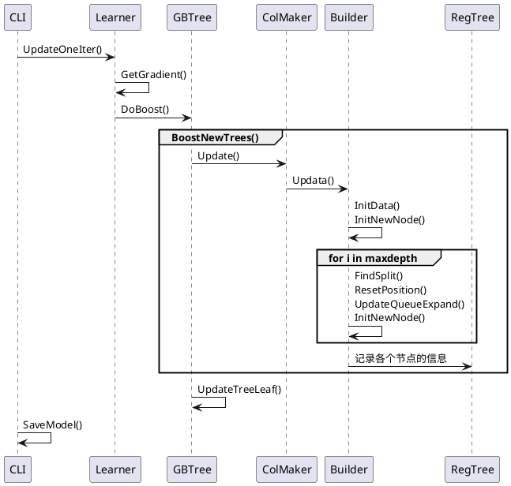
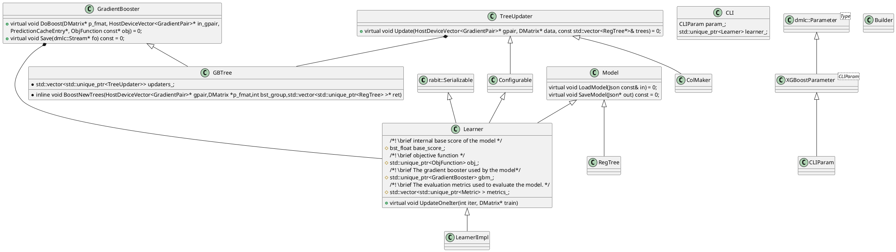

# xgboost


# 介绍

xgboost全称是extreme Gradient Boosting，可以看做是GBDT算法(Gradient Boosting Decision Tree)的高效实现。

随着xgboost的发展，与GDBT的区别越来越大。但是其与GDBT的主要区别有两点：

1. 传统GBDT在优化时只用到[一阶导数](https://www.zhihu.com/search?q=一阶导数&search_source=Entity&hybrid_search_source=Entity&hybrid_search_extra={"sourceType"%3A"answer"%2C"sourceId"%3A98658997})信息，xgboost则对[损失函数](https://www.zhihu.com/search?q=代价函数&search_source=Entity&hybrid_search_source=Entity&hybrid_search_extra={"sourceType"%3A"answer"%2C"sourceId"%3A98658997})进行了二阶泰勒展开，同时用到了一阶和[二阶导数](https://www.zhihu.com/search?q=二阶导数&search_source=Entity&hybrid_search_source=Entity&hybrid_search_extra={"sourceType"%3A"answer"%2C"sourceId"%3A98658997})，使得模型可以更快收敛。
2. xgboost在代价函数里加入了正则项，用于[控制模型](https://www.zhihu.com/search?q=控制模型&search_source=Entity&hybrid_search_source=Entity&hybrid_search_extra={"sourceType"%3A"answer"%2C"sourceId"%3A98658997})的复杂度。

## 1.1 相关概念

### 1.1.1 Boosting与Bagging

Boosting方法训练基分类器时采用串行的方式，各个基分类器之间有依赖。它的基本思路是将基分类器层层叠加，每一层在训练的时候，对前一层基分类器分错的样本，给予更高的权重。测试时，根据各层分类器的结果的加权得到最终结果。

Bagging在生成多个数据样本后，将单独训练这些弱模型，根据任务类型（如回归或分类），这些预测的平均值或多数值会产生预测值。

Bagging与Boosting的串行训练方式不同，Bagging方法在训练过程中，各基分类器之间无强依赖，可以进行并行训练。

### 1.1.2 GDBT

**GBDT的原理如下**：

- 所有弱分类器的结果相加等于预测值。
- 每次都以当前预测为基准，下一个弱分类器去拟合误差函数对预测值的残差（预测值与真实值之间的误差）。
- GBDT的弱分类器使用的是树模型。


如图是一个帮助理解的示例，用 GBDT 去预测年龄：

- 第一个弱分类器（第一棵树）预测一个年龄（如20岁），计算发现误差有 10岁；
- 第二棵树预测拟合残差，预值 6，计算发现差距还有 4岁；
- 第三棵树继续预测拟合残差，预测值 3，发现差距只有1岁了；
- 第四课树用 1 岁拟合剩下的残差，完成。

最终，四棵树的结论加起来，得到 30 岁这个标注答案（实际工程实现里，GBDT 是计算负梯度，用负梯度近似残差）。

### 1.1.3 CART（classification and regression tree）

CART又叫分裂回归树，是一个二叉树，可以处理回归与分类问题。其余还有ID3和C4.5算法，生成的决策树是多叉树，只能处理分类不能处理回归。

xgboost与GDBT的基学习器都是CART，xgboost额外支持线性分类器，但是由于xgboost on spark不支持线性分类器，所以目前只关注CART。

该算法结构如图所示，其中最后叶子结点的值在xgboost中为weight：


CART树的生成主要步骤为：

1. 选取切分点

假设样本只有一个特征，首先将样本按照特征值进行排序，之后通过遍历该特征的值，选取该点左侧的内容放入左节点，右侧内容放入右节点。得到新的树，然后通过设计的评估函数来评估新的树，找出能最好的满足该评估函数的分裂方式。


2. 更新数据位置

假设上方最符合的点为ai，则将对应样本放入对应节点，则生成新的树，再进行下一轮的分裂。


## 1.2 模型定义

$$
\hat y_i = F_{K}(x_i) = F_{K}(x_{i - 1}) + f_K(x_i)
\\
f_{K}表示第K棵决策树
$$

决策树会对样本特征进行映射，使每个样本落在该树的某个叶子节点上。每个叶子节点均包含一个权重分数，作为落在次叶子节点的样本在本科书的预测值``。计算样本在每棵树的预测值之和，作为样本的最终预测值。

## 1.3 目标函数

$$
Obj = \sum_{i = 1}^{n} L(y_i, \hat y_i) + \sum_{k = 1}^{K}\Omega(f_k)
$$

$\hat y^s_i = \hat y^{(s-1)}_i + \hat f(x_i)$：第s轮的模型等于s-1轮的加上第s轮生成的，因此目标为找到每一轮的``使得Obj最小。

$\sum_{i = 1}^{n} L(y_i, \hat y_i) $：损失函数，后面需要通过二阶泰勒逼近，所以必须可微且是凸函数（向下凸）

$\sum_{k = 1}^{K}\Omega(f_k)  $：正则项  $\Omega(f) = \gamma T + \frac{1}{2}\parallel \omega \parallel ^ 2 $

$ \gamma T $ ：控制树复杂度，叶子节点数及其系数

$\frac{1}{2}\parallel \omega \parallel ^ 2 $：控制叶子结点的权重分数

## 1.4 目标函数近似

### 1.4.1 改写

$$
Obj = \sum_{i = 1}^{n} L(y_i, \hat y^{(s-1)}_i + \hat f_{s}(x_i)) + \sum_{k = 1}^{K}\Omega(f_k)  \\i:样本 \\ \hat f_s(x_i):第s轮生成的模型。
$$

### 1.4.2 Taylor展开，合并常数项，找最优权重

$$
Obj^{(s)} = -\frac{1}{2}\sum_{T}^{j=1}\frac{G_j^2}{H_j + \lambda } + \gamma T
\\ Gj = \sum_{i\subset I_j}^{}g_i 
\quad g_i =  \frac{\partial L(y_i, \hat y^{(s - 1)})}{\partial \hat{y}^{s - 1}}
\\ Hj = \sum_{i\subset I_j}^{}h_i 
\quad h_i = \frac{\partial ^2L(y_i, \hat y^{(s-1)})}{\partial \hat y ^{(s - 1)}}
$$

通过以上近似目标函数，每一轮的目标就是找到最小Obj。

由上可知，Obj是每个叶子节点的Obj的和，因此在分裂时可以计算单个叶子节点分裂后对总体Obj的影响，来确定分裂点。

xgboost在每轮分裂时使用贪心的思路，计算分裂后的值是否比分裂前少，并记录最佳的分裂点

判断标准：

$$
Obj_j = -\frac{1}{2}\frac{G_j^2}{H_j + \lambda } + \gamma
\\
Obj_s = -\frac{1}{2}\left ( \frac{G_{jL}^2}{H_{jL} + \lambda } + \frac{G_{jR}^2}{H_{jR} + \lambda } \right ) + \gamma
\\
Obj_{split} = Obj_j - Obj_s =  \frac{1}{2}\left ( \frac{G_{jL}^2}{H_{jL} + \lambda } + \frac{G_{jR}^2}{H_{jR} + \lambda } - \frac{G_{}^2}{H_{} + \lambda } \right ) - \gamma
$$
j 为叶子节点

由于以上的梯度计算只涉及到当前节点的样本与前一轮训练后的模型信息（详见1.7.2），而叶子节点间相互没有影响，所以可以一次计算出所有的叶子节点的分裂点。

## 1.5 更新目标与策略

目标：树的目标函数(Obj)最小，Obj与叶子节点有关。

策略：贪心，通过$Obj_{split}$找到每一次节点分裂时使得Obj减少最多的特征与切分点，也就是``最大的点。


## 1.6 理论训练过程

该计算过程对应上述理论，并没有进行工程上的优化

1. 开始新一轮树的分裂
2. 按层依次遍历各节点上的样本的各特征，找出最佳分裂点，也就是按照该分裂点分裂后生成的新树$Obj_{split}$最大。
3. 剪枝，如果算得的$Obj_{split}$小于设置的阈值，则不进行分裂。
4. 将最终的树加入模型

$$
\hat y_i^s = y_{i - 1}^s + \eta f_s(x_i)
\\
\eta 为缩减系数
$$

## 1.7 xgboost工程实现

### 1.7.1 xgboost优化

xgboost对于上述做了优化

1. 各样本的梯度只与之前的树有关。所以在每次生成新的树前，可以提前计算所有样本的梯度并存储起来。
2. 对于切分点的遍历，因为仅跟特征值以及特征有关，所以可以将数据按照特征进行存储，也就是CSC存储，同时保存指向该特征值对应样本的索引。将上述数据每列（也就是每个特征）按照特征值进行排序，之后只要遍历一次该数据，就可以获取所有叶子节点对应的最佳分裂点。

### 1.7.2 梯度计算

由上可知

$$
Gj = \sum_{i\subset I_j}^{}g_i 
\quad g_i =  \frac{\partial L(y_i, \hat y^{(s - 1)})}{\partial \hat{y}^{s - 1}}
\\ Hj = \sum_{i\subset I_j}^{}h_i 
\quad h_i = \frac{\partial ^2L(y_i, \hat y^{(s-1)})}{\partial \hat y ^{(s - 1)}}
$$
可以看出梯度只与之前的生成树有关，对于梯度计算，按照不同的损失函数计算的公式不同。这里举一个[例子](https://blog.csdn.net/zlb872551601/article/details/103609622)：

设损失函数$L(y_i, \hat y_i) = (y_i - \hat y_i)^2$

则有

$g_i =  \frac{\partial L(y_i, \hat y^{(s - 1)})}{\partial \hat{y}^{s - 1}} = -2(y_i - \hat y_{i - 1})$

$h_i = \frac{\partial ^2L(y_i, \hat y^{(s-1)})}{\partial \hat y ^{(s - 1)}} = -2$

对于初始化时没有前一轮的数据，于是有一个全局偏置的超参，base_score：初始化预测分数，全局偏置。用于提供第一次梯度的计算。

### 1.7.2 训练过程（单机精确贪心）

1. 数据准备
2. 训练
   1. 生成新树
      1. 根据前几轮生成的模型，计算梯度数据
      2. csc存储，特征按照特征值进行排序
         1. 按层分裂
            1. 行/列采样
            2. 遍历每个特征的特征值
               1. 计算将其放入左/右子节点后，对应节点在该特征值进行分裂的$Obj_{split}$
               2. 与之前的$Obj_{split}$进行对比，得到该特征在该节点上的最佳特征值
            3. 比较各叶子节点对不同特征的最佳分裂值的$Obj_{split}$，得到最佳的分裂点
            4. 创建新的节点，将样本位置指向新的节点上
            5. 如果达到规定的最大层数或者没有可更新的节点，退出
   2. 生成后剪枝
3. 存储模型

流程图


# 2. 源码

## 2.1 代码结构

```
|--xgboost
    |--include
        |--xgboost        //定义了 xgboost 相关的头文件
    |--src  
        |--c_api               
        |--common         //一些通用文件，如对配置文件的处理
        |--data           //使用的数据结构，如 DMatrix
        |--gbm            //定义分类器，如 gbtree 和 gblinear
        |--metric         //定义评价函数
        |--objective      //定义目标函数
        |--tree           //对树的一些列操作
        |--collective     //集合通讯，AllReduce实现
```

程序主入口为src中的cli_main.cc，其中调用了cli.Run()，run中主要内容如下

```
//cli_main.cc

|--main()

    |--Run()

        |--switch(param.task)

            {  
                Case kTrain: CLITrain();break;

                Case KDumpModel: CLIDumpModel();break;

                Case KPredict: CLIPredict();break;

            }
```

## 2.2 单机训练

单机训练以回归任务为例，分类与此相似。

### 2.2.1 时序图




### 2.2.2 类图




从图中可以看出在训练中最重要的两个接口为GradientBooster以及TreeUpdater，两者一个规定了基学习器，一个规定了更新方法。

同时还有xgboost中存储cart树的类RegTree，其中以数组形式对树进行存储。

### 2.2.3 CLITrain的主要逻辑  

```
Learner:训练的接口，成员变量有目标函数obj_，梯度提升模型gbm_，评估器metrics_，训练上下文ctx_

ObjFunction：目标函数接口，GetGradient

GradientBooster：基学习器接口

TreeUpdater：树update接口，Update()，有多个子类。例如：适用于单机的精确贪心ColMaker，适用于分布式的全局近似逼近GlobalApproxUpdater
  
Builder:TreeUpdater中的成员变量，实际执行Update()

Metric：评估器接口

Context：训练上下文

Model：模型接口，定义了存储模型和读取模型的方法

Configurable：配置接口，定义了存储和读取配置的方法

dmlc::Serializable：确保可序列化
```

CLITrain的主要逻辑如下

```
|--CLITrain()

    |--DMatrix::Load() // 训练数据加载入内存

  	|--ResetLearner() // Learner初始化
  
    |--for (int iter = 0; iter < max_iter;   ++iter) //训练与评估

        {

                Learner::UpdateOneIter();

                Learner::EvalOneIter();

        }
```

#### 数据加载

在CLITrain中，通过param中的train_path，将训练数据加载进std::shared_ptr<DMatrix> dtrain，并存储进缓存中cache_mats。之后加载评价数据进eval_datasets与cache_mats中。

```
|--DMatrix
		// 各种元信息
    |--MetaInfo
    
    		|--std::vector<std::string> feature_names;

				|--...
```

#### Learner初始化

利用上面生成的cache_mats，使用ResetLearner函数对Learner进行初始化返回LearnerImpl，同时使用cache初始化LearnelIO。

继承路线为


```plantUML
@startuml
Model <|-down- Learner
Configurable <|-down- Learner
dmlc::Serializable <|-down- Learner
Learner <|- LearnerConfiguration 
LearnerConfiguration <|- LearnerIO 
LearnerIO <|- LearnerImpl
@enduml
```

```
  	|--ResetLearner() // Learner初始化
  			
        |--Learner::Create()

          	|--LearnerImpl
        
    		|--Learner::SetParams()
```

### 2.2.4 Learner::UpdateOneIter

```
|--Learner::UpdateOneIter()
		// 初始化Learner
    |--LearnerConfiguration::Configure()
  	// 计算输入数据的base_core，存储进mparam_.base_score变量
  	|--LearnerConfiguration::InitBaseScore()
  	// 检测训练数据是否有效，主要是检测训练数据特征数与learner模型参数中的特征数是否相同
  	// 以及训练数据是否是空集，如果训练数据行数为0直接error
  	|--LearnerImpl::ValidateDMatrix()
  	// 缓存训练数据以及gpu_id，生成后续训练的存储预测结果的输出数组predt
  	|--PredictionContainer::Cache()
  	// 预测训练数据结果，存储于predt中
  	|--LearnerImpl::PredictRaw()
		// 计算并记录初始的hess和gradient的值，用来查找下一轮分裂点，具体实现会根据集成的子类
    // 进行实现，最后结果会存储在gpair_中，其类型为GradientPairInternal的实现类GradientPair
    // 包含hess_,grad_并且有相应的Add()等函数
    |--ObjFunction::GetGradient()

    |--GradientBooster::DoBoost()
```

主要逻辑为两部分：

1. 生成初始化的数据
2. 进行树的生成

树的生成从DoBoost开始，GradientBooster的子类中，Class GBTree 用的比较多。 DoBoost() 函数执行的操作如下：

```
//gbtree.cc

|--GBTree::DoBoost()

    |--GBTree::BoostNewTrees()
  
  			|--TreeUpdater:Update()
		// 更新叶子节点权重，增加泛化性能
  	|--GBTree::UpdateTreeLeaf()
```

DoBoost() 调用了 BoostNewTrees() 函数。在 BoostNewTrees() 中先初始化了 TreeUpdater 实例，在调用其 Update 函数生成一棵回归树。TreeUpdater 是一个抽象类，根据使用算法不同其派生出许多不同的 Updater，这些 Updater 都在 src/tree 目录下。

```
|--include
		|--tree_updater.h 
    /*
    定义了TreeUpdater接口
    */
|--src

    |--tree

				|--updater_approx.cc
        /*
        class GlobalApproxUpdater 使用的是直方图法；
        */
        
        |--updater_colmaker.cc
        /*
        class ColMaker 使用的是基本枚举贪婪搜索算法，通过
        枚举所有的特征来寻找最佳分裂点；
				*/

        |--updater_gpu_hist.cc
        /*
        class GPUHistMaker，GPUGlobalApproxMaker 基于gpu的直方图实现；
        */
        
        |--updater_prune.cc
        /*
        class TreePruner 是树的剪枝操作；
        */
        
        |--updater_quantile_hist.cc
        
        /*
        class QuantileHistMaker 使用的是直方图法；
        */
        
        |--updater_refresh.cc    
        /*
        class TreeRefresher 用于刷新数据集上树的统计信息和叶子值；
        */
        
        |--updater_sync.cc
        /*
        class TreeSyncher 是在分布式情况下保证树的一致性。
        */
```

### 2.2.5 ColMaker

使用精确贪心

在 Class ColMaker 定义了一些数据结构用于辅助树的构造。

```
struct ThreadEntry // 存储每个节点暂时的状态，数量为：线程 * 每个线程的节点
struct NodeEntry   // 同样存储信息，存储每个节点的root_gain, weight等
class Builder{  		 // 实际运行Updata的类
 	const TrainParam& param; //训练参数，即我们设置的一些超参数
	std::vector<int> position;  //当前样本实例在回归树结中对应点的索引
	std::vector<NodeEntry> snode; //回归树中的结点
	std::vector<int> qexpand_;  //保存将有可能分裂的节点的索引 
}
```

在 Class ColMaker 中定义了一个 Class Builder 类，树所有的构造过程都由这个类完成

具体内容如下

```
    virtual void Update(const std::vector<GradientPair>& gpair,
                        DMatrix* p_fmat,
                        RegTree* p_tree) {
      std::vector<int> newnodes;
      /*
      1. 初始化position_，有无效或者抽样没有抽到的数据，就将position_中对应的值取反
      2. 初始化列采样器 column_sampler_
      3. 初始化单个节点构造时的统计信息存储结构 stemp_，清空，大小设置为256，使用时通过读取对应线程id与
      节点id，来获取hess(hessian)和grad(gradian)数据，存储的是已经遍历过的特征数据
      4. 初始化单个节点统计信息存储结构 snode_，清空，大小设置为256
      5. 初始化待分裂节点队列qexpand_，清空，初始有一个0
      */
      this->InitData(gpair, *p_fmat);
      /*
      计算结点增益root_gain，也就是未分裂该节点的损失函数，将用于判断该点是否需要分裂。
      计算当前点的权值weight，最终模型输出就是叶子结点 weight 的线性组合。
      
      含有并行计算，通过stemp_记录每个线程相同节点的hess和grad，
      汇总到主线程后。计算当前节点的root_gain与weight
      */
      this->InitNewNode(qexpand_, gpair, *p_fmat, *p_tree);
      // We can check max_leaves too, but might break some grid searching pipelines.
      CHECK_GT(param_.max_depth, 0) << "exact tree method doesn't support unlimited depth.";
      // 按照深度开始生成树
      for (int depth = 0; depth < param_.max_depth; ++depth) {
        /* 
        寻找最佳分裂点，同时计算权重
        */
        this->FindSplit(depth, qexpand_, gpair, p_fmat, p_tree);
        /*
        更新各个数据对应树节点的位置，也就是更新position_
        */
        this->ResetPosition(qexpand_, p_fmat, *p_tree);
        /*
        更新待分裂节点，如果这个节点这一轮没有分裂，就去掉
        qexpand_
        */
        this->UpdateQueueExpand(*p_tree, qexpand_, &newnodes);
        /*
        更新新叶子节点的权值，增益
        */
        this->InitNewNode(newnodes, gpair, *p_fmat, *p_tree);
        for (auto nid : qexpand_) {
          if ((*p_tree)[nid].IsLeaf()) {
            continue;
          }
          int cleft = (*p_tree)[nid].LeftChild();
          int cright = (*p_tree)[nid].RightChild();
					/*
          给定的树节点上应用约束条件，通过调整节点的上下界来影响树的生长过程，
          从而优化模型的性能
          */
          tree_evaluator_.AddSplit(nid, cleft, cright, snode_[nid].best.SplitIndex(),
                                   snode_[cleft].weight, snode_[cright].weight);
          /*
          管理和应用特征交互约束。通过记录先前的分裂历史和处理交互约束，代码
          确保在新节点中允许使用的特征受到先前约束的影响。
          */
          interaction_constraints_.Split(nid, snode_[nid].best.SplitIndex(), cleft, cright);
        }
        qexpand_ = newnodes;
        // if nothing left to be expand, break
        if (qexpand_.size() == 0) break;
      }
      // set all the rest expanding nodes to leaf
      for (const int nid : qexpand_) {
        (*p_tree)[nid].SetLeaf(snode_[nid].weight * param_.learning_rate);
      }
      // remember auxiliary statistics in the tree node
      for (int nid = 0; nid < p_tree->NumNodes(); ++nid) {
        p_tree->Stat(nid).loss_chg = snode_[nid].best.loss_chg;
        p_tree->Stat(nid).base_weight = snode_[nid].weight;
        p_tree->Stat(nid).sum_hess = static_cast<float>(snode_[nid].stats.sum_hess);
      }
    }
```

### 2.2.6 FindSplit()

其中调用了UpdateSolution，对于训练数据batch（此时按照value排序，CSC存储模式，每一行都是一组排好序的feature value）查找时通过feat_set遍历所有的特征id，在batch中读取对应的特征值，之后通过EnumerateSplit并行计算不同特征的最佳分裂点。各线程的计算结果存储在对应stemp_[tid]中。计算完成后，通过stemp_中的数据，将结果更新到snode_中。 

ColMaker属于单机执行，且规定其所有[数据都会存储于一个batch中](https://zhuanlan.zhihu.com/p/34964065#:~:text=在精确贪心算法中，我们把整个数据集存储在一个块中，)（此块外界有各种说法，通过阅读相关源码后得出这个结论）。

在生成batch的过程中，可以看到一个batch的存储内容就是一个page。

```
BatchSet<SortedCSCPage> 
SimpleDMatrix::GetSortedColumnBatches(Context const* ctx) {
  ...
  auto begin_iter =
      BatchIterator<SortedCSCPage>(new SimpleBatchIteratorImpl<SortedCSCPage>(sorted_column_page_));
  ...
}
}  // namespace xgboost::data
```

page是DMatrix中的内容，通过读取数据后遍历读取的迭代器，全部存储入page_中，因此单机模式下，可以看出一个page中就会保存所有内容。

```
DMatrix* DMatrix::Load(const std::string& uri,
                       bool silent, DataSplitMode data_split_mode) {
  ...
    // 通过
    std::unique_ptr<dmlc::Parser<std::uint32_t>> parser(
    		// 生成解析器，单机模式下解析器partid = 1，naprt = 1，不分片。
        dmlc::Parser<std::uint32_t>::Create(fname.c_str(),
                                            partid, npart, "auto"));
        data::FileAdapter adapter(parser.get());
        dmat = DMatrix::Create(&adapter, std::numeric_limits<float>::quiet_NaN(),
                               Context{}.Threads(),
                               cache_file,
                               data_split_mode);
  ...
}

template <typename AdapterT>
SimpleDMatrix::SimpleDMatrix(AdapterT* adapter, float missing, int nthread,
                             DataSplitMode data_split_mode) {
....
  while (adapter->Next()) {
....
  // 所有的数据全部写入page中
    auto batch_max_columns = sparse_page_->Push(batch, missing, ctx.Threads());
....
    }
  }
```

综上，单机模式下，FindSplit时一个线程会一次扫描单个特征的所有特征值。

### 2.2.7 剪枝

每一轮树生成后，都会进行一次剪枝。剪枝分布式情况下，剪枝完会同步信息。

```
  void Update(TrainParam const* param, HostDeviceVector<GradientPair>* gpair, DMatrix* p_fmat,
              common::Span<HostDeviceVector<bst_node_t>> out_position,
              const std::vector<RegTree*>& trees) override {
    pruner_monitor_.Start("PrunerUpdate");
    for (auto tree : trees) {
      this->DoPrune(param, tree);
    }
    syncher_->Update(param, gpair, p_fmat, out_position, trees);
    pruner_monitor_.Stop("PrunerUpdate");
  }
```

剪枝条件为：当前节点收益小于最小收益，或者深度超过最大深度。

```
 return loss_chg < this->min_split_loss || 
   (this->max_depth != 0 && depth > this->max_depth);
```

### 2.2.8 OpenMp

xgboost的多线程依赖OpenMp实现。编译器根据程序中添加的pragma指令，自动将程序并行处理，使用OpenMP降低了并行编程的难度和复杂度。当编译器不支持OpenMP时，程序会退化成普通（串行）程序。程序中已有的OpenMP指令不会影响程序的正常编译运行。

# 3. xgboost on spark实现

spark下各个节点计算自己的数据，生成直方图，最后通过基于AllReduce算法构成的rabbit分布式框架进行汇总数据，生成总的直方图，之后分裂节点，通过AllReduce进行同步。

关于xgboost分布式实现没有使用精确贪心的原因，作者在论文中有相应解释，以下是对应内容的翻译。大致意思为：精确贪心与近似直方图在精度上没有大的差异，同时近似直方图适用于分布式的情况，可以处理更大的数据量。

点击展开内容

在分布式实现中，xgboost采用了一种近似方法，因为当数据不能完全读入内存时，类似精确贪心这种贪婪地枚举除了所有可能分裂点的方法非常低效，因此AllReduce采用了一种近似方法，同时通过实验得出双方差距并不大，结果如图。

该算法首先根据特征分布的百分位数提出可能的候选分裂点。然后算法将连续特征值映射到候选分割点分割出的箱子中。计算出每个箱子中数据的统计量，然后根据统计量找到最佳的分割点。

该算法有两种变体，区别为分裂点的准则何时给出。全局选择在树构造的初始阶段要求给出所有候选分裂点，并且在树的所有层中使用相同的分裂节点用于分裂。局部选择在分裂后重新给出分裂候选节点。全局方法比局部方法需要更少的步骤。然而，通常在全局选择中需要更多的候选点，因为在每次分裂后候选节点没有被更新。局部选择在分裂后更新候选节点，并且可能更适合于深度更深的树。图3给出了基于希格斯玻色子数据集的不同算法的比较。我们发现，本地变种确实需要更少的候选人。当给出足够的候选节点，全局变种可以达到与本地变种一样的准确率。

直接构造梯度统计量的近似直方图也是可行的。也可以使用分箱策略来代替分位数划分。使用分位数的优点是可分配和可重计算。

## 3.1 AllReduce

AllReduce其实是一类算法，目标是高效得将不同机器中的数据整合（reduce）之后再把结果分发给各个机器。

这里简单介绍下rabbit使用的Ring AllReduce。其结构如下所示


举个例子：

需要做到以下的输出结果


第一阶段，将N个worker分布在一个环上，并且把每个worker的数据分成N份。


接下来我们具体看第k个worker，这个worker会把第k份数据发给下一个worker，同时从前一个worker收到第k-1份数据。


之后worker会把收到的第k-1份数据和自己的第k-1份数据整合，再将整合的数据发送给下一个worker。


以此循环N次之后，每一个worker都会包含最终整合结果的一份。


第二阶段，每个worker将整合好的部分发送给下一个worker。worker在收到数据之后更新自身数据对应的部分即可。

## 3.2 训练链路

### 3.2.1 时序图


```plantUML
@startuml
group 数据生成
  spark -> java : DMatrix创建 XGDMatrixCreateFromDataIter
  java -> "c++" : Java_ml_dmlc_xgboost4j_java_XGBoostJNI_XGDMatrixCreateFromDataIter
end
"c++" -> java
java -> spark
group 训练
spark ->java:XGBoostJNI::XGBoosterBoostOneIter
java -> "c++": Java_ml_dmlc_xgboost4j_java_XGBoostJNI_XGBoosterBoostOneIter:jni调用
end
"c++" -> java:model
java -> spark:model
@enduml
```

### 3.2.2 训练拓扑图


## 3.3 数据生成

在spark端，生成batchIter，存储数据结构为LabeledPoint，大小为32k条数据。

```
  public DMatrix(Iterator<LabeledPoint> iter, String cacheInfo) throws XGBoostError {
    if (iter == null) {
      throw new NullPointerException("iter: null");
    }
    // 32k as batch size
    int batchSize = 32 << 10;
    Iterator<DataBatch> batchIter = new DataBatch.BatchIterator(iter, batchSize);
    long[] out = new long[1];
    XGBoostJNI.checkCall(XGBoostJNI.XGDMatrixCreateFromDataIter(batchIter, cacheInfo, out));
    handle = out[0];
  }
```

xgboost中，通过jni接取到batch中，将batch的数据解析后存储到自身的DMatrix中，并且返回指向该DMatrix的指针，之后训练通过传入该指针进行训练数据的读取。

## 3.4 训练

相对于单机，在spark时已经进行了数据的生成，所以在调用时直接生成树，于是直接调用Doboost。

### 3.4.1 spark支持的booster与updater

1. gbtree的booster
2. 分布式相关的更新器，后两种在2.0中可以使用

"grow_histmaker,prune"，"grow_quantile_histmaker"，"grow_gpu_hist"的updater。

### 3.4.2 GlobalApproxUpdater

除了gpu的updater，xgboost on spark的updater使用全局近似直方图。

#### 全局近似直方图

直方图就是一定范围内数据的集合，根据切分点划分。近似算法首先按照特征取值的统计分布的一些百分位点确定一些候选分裂点，然后算法将连续的值映射到 buckets中，然后汇总统计数据，并根据聚合统计数据在候选节点中找到最佳节点。

每个节点都会算自己节点上数据的直方图，根据切分点进行划分，汇总对应结构上的梯度数据。最后计算好直方图后进行汇总，进行节点分裂，之后同步分裂数据。

- 直方图存储的结构

class GHistRow实际是里面的double数组。

- 直方图存储逻辑

叶子节点中一个特征就是一个直方图，不同的数据的不同特征通过预处理的GHistIndexMatrix结构对应到对应直方图的位置。

- 切分点存储结构是什么

GHistIndexMatrix 中的uint8_t数组。

- 构建直方图所需要的数组在什么时候初始化的

在构建直方图时，开始遍历DMatrix就会构建梯度索引：p_fmat->GetBatches<GHistIndexMatrix>。通过该索引，存储特征值的Entry可以索引到其对应的直方图，从而实现直方图的构建。


```
  /** Main entry point of this class, build histogram for tree nodes. */
  void BuildHist(std::size_t page_idx, common::BlockedSpace2d const &space,
                 GHistIndexMatrix const &gidx, common::RowSetCollection const &row_set_collection,
                 std::vector<bst_node_t> const &nodes_to_build,
                 linalg::VectorView<GradientPair const> gpair, bool force_read_by_column = false) {
    ...
    if (gidx.IsDense()) {
      this->BuildLocalHistograms<false>(space, gidx, nodes_to_build, row_set_collection,
                                        gpair.Values(), force_read_by_column);
    } else {
      this->BuildLocalHistograms<true>(space, gidx, nodes_to_build, row_set_collection,
                                       gpair.Values(), force_read_by_column);
    }
  }

template <bool do_prefetch, class BuildingManager>
void RowsWiseBuildHistKernel(Span<GradientPair const> gpair,
                             const RowSetCollection::Elem row_indices, const GHistIndexMatrix &gmat,
                             GHistRow hist) {
	...
  // 梯度索引数组，存储当前特征值指向哪个直方图
  const BinIdxType *gradient_index = gmat.index.data<BinIdxType>();
	...

  for (std::size_t i = 0; i < size; ++i) {
    // 对每一行特征进行处理
    // 列的开始
    const size_t icol_start =
        kAnyMissing ? get_row_ptr(rid[i]) : get_rid(rid[i]) * n_features;
    const size_t icol_end =
        kAnyMissing ? get_row_ptr(rid[i] + 1) : icol_start + n_features;

    const size_t row_size = icol_end - icol_start;
    // row_index: 样本索引
    const size_t idx_gh = two * rid[i];

    if (do_prefetch) {
      const size_t icol_start_prefetch =
          kAnyMissing
              ? get_row_ptr(rid[i + Prefetch::kPrefetchOffset])
              : get_rid(rid[i + Prefetch::kPrefetchOffset]) * n_features;
      const size_t icol_end_prefetch =
          kAnyMissing ? get_row_ptr(rid[i + Prefetch::kPrefetchOffset] + 1)
                      : icol_start_prefetch + n_features;

      PREFETCH_READ_T0(p_gpair + two * rid[i + Prefetch::kPrefetchOffset]);
      for (size_t j = icol_start_prefetch; j < icol_end_prefetch;
           j += Prefetch::GetPrefetchStep<uint32_t>()) {
        PREFETCH_READ_T0(gradient_index + j);
      }
    }
    const BinIdxType *gr_index_local = gradient_index + icol_start;

    // The trick with pgh_t buffer helps the compiler to generate faster binary.
    const float pgh_t[] = {p_gpair[idx_gh], p_gpair[idx_gh + 1]};
    for (size_t j = 0; j < row_size; ++j) {
      // 特征对应直方图的索引，通过梯度数组[特征位于样本的第几个] + 后面的判断
      const uint32_t idx_bin =
          two * (static_cast<uint32_t>(gr_index_local[j]) + (kAnyMissing ? 0 : offsets[j]));
      // 聚合直方图对应特征的内容
      auto hist_local = hist_data + idx_bin;
      *(hist_local) += pgh_t[0];
      *(hist_local + 1) += pgh_t[1];
    }
  }
}
```

在实际训练时，通过BoostNewTrees()的调用，获取需要更新的树，如果参数为kDefault则是生成新的树，如果为kUpdate则是将已有的树再次更新。

```
void GBTree::BoostNewTrees(HostDeviceVector<GradientPair>* gpair, DMatrix* p_fmat, int bst_group,
                           std::vector<HostDeviceVector<bst_node_t>>* out_position,
                           TreesOneGroup* ret) {
  std::vector<RegTree*> new_trees;
  ret->clear();
  // create the trees
  for (int i = 0; i < model_.param.num_parallel_tree; ++i) {
    // 新树的生成
    if (tparam_.process_type == TreeProcessType::kDefault) {
      CHECK(!updaters_.empty());
      CHECK(!updaters_.front()->CanModifyTree())
          << "Updater: `" << updaters_.front()->Name() << "` "
          << "can not be used to create new trees. "
          << "Set `process_type` to `update` if you want to update existing "
             "trees.";
      // create new tree
      std::unique_ptr<RegTree> ptr(new RegTree{this->model_.learner_model_param->LeafLength(),
                                               this->model_.learner_model_param->num_feature});
      new_trees.push_back(ptr.get());
      ret->push_back(std::move(ptr));
    } else if (tparam_.process_type == TreeProcessType::kUpdate) 
      for (auto const& up : updaters_) {
        CHECK(up->CanModifyTree())
            << "Updater: `" << up->Name() << "` "
            << "can not be used to modify existing trees. "
            << "Set `process_type` to `default` if you want to build new trees.";
      }
      CHECK_LT(model_.trees.size(), model_.trees_to_update.size())
          << "No more tree left for updating.  For updating existing trees, "
          << "boosting rounds can not exceed previous training rounds";
      // move an existing tree from trees_to_update
    	// 使用已有的树
      auto t = std::move(model_.trees_to_update[model_.trees.size() +
                                                bst_group * model_.param.num_parallel_tree + i]);
      new_trees.push_back(t.get());
      ret->push_back(std::move(t));
    }
  ...
    // 更新树
    for (auto& up : updaters_) {
    	up->Update(&tree_param_, gpair, p_fmat,
                 common::Span<HostDeviceVector<bst_node_t>>{*out_position}, new_trees);
  	}
  ...
  }
```

首先初始化数据，找到需要分裂的点以及生成节点对应的直方图。之后遍历需要分裂的点，看是否可以分裂。如果可以分裂则重新分配数据集，并且构建分裂后点的直方图并且加入队列中等待遍历，当树Update完毕后，同步新树的信息。

```
  void Update(TrainParam const *param, HostDeviceVector<GradientPair> *gpair, DMatrix *m,
              common::Span<HostDeviceVector<bst_node_t>> out_position,
              const std::vector<RegTree *> &trees) override {
    CHECK(hist_param_.GetInitialised());
    pimpl_ = std::make_unique<GloablApproxBuilder>(param, &hist_param_, m->Info(), ctx_,
                                                   column_sampler_, task_, &monitor_);

    linalg::Matrix<GradientPair> h_gpair;
    // Obtain the hessian values for weighted sketching
    InitData(*param, gpair, &h_gpair);
    std::vector<float> hess(h_gpair.Size());
    auto const &s_gpair = h_gpair.Data()->ConstHostVector();
    std::transform(s_gpair.begin(), s_gpair.end(), hess.begin(),
                   [](auto g) { return g.GetHess(); });

    cached_ = m;

    std::size_t t_idx = 0;
    for (auto p_tree : trees) {
      this->pimpl_->UpdateTree(m, s_gpair, hess, p_tree, &out_position[t_idx]);
      hist_param_.CheckTreesSynchronized(p_tree);
      ++t_idx;
    }
  }


  void UpdateTree(DMatrix *p_fmat, std::vector<GradientPair> const &gpair, common::Span<float> hess,
                  RegTree *p_tree, HostDeviceVector<bst_node_t> *p_out_position) {
    p_last_tree_ = p_tree;
    this->InitData(p_fmat, p_tree, hess);

    Driver<CPUExpandEntry> driver(*param_);
    auto &tree = *p_tree;
    driver.Push({this->InitRoot(p_fmat, gpair, hess, p_tree)});
    auto expand_set = driver.Pop();

    /**
     * Note for update position
     * Root:
     *   Not applied: No need to update position as initialization has got all the rows ordered.
     *   Applied: Update position is run on applied nodes so the rows are partitioned.
     * Non-root:
     *   Not applied: That node is root of the subtree, same rule as root.
     *   Applied: Ditto
     */

    while (!expand_set.empty()) {
      // candidates that can be further splited.
      // 下一轮的子节点可以接着切分的点
      std::vector<CPUExpandEntry> valid_candidates;
      // candidates that can be applied.
      // 本轮可以切分的节点
      std::vector<CPUExpandEntry> applied;
      for (auto const &candidate : expand_set) {
        // 分裂节点
        evaluator_.ApplyTreeSplit(candidate, p_tree);
        applied.push_back(candidate);
        if (driver.IsChildValid(candidate)) {
          valid_candidates.emplace_back(candidate);
        }
      }

      monitor_->Start("UpdatePosition");
      size_t page_id = 0;
      for (auto const &page :
           p_fmat->GetBatches<GHistIndexMatrix>(ctx_, BatchSpec(*param_, hess))) {
        /**
         * 节点分裂后，数据集的重新分配和更新
        */
        partitioner_.at(page_id).UpdatePosition(ctx_, page, applied, p_tree);
        page_id++;
      }
      monitor_->Stop("UpdatePosition");

      std::vector<CPUExpandEntry> best_splits;
      if (!valid_candidates.empty()) {
        // 会基于左右子节点构筑直方图
        this->BuildHistogram(p_fmat, p_tree, valid_candidates, gpair, hess);
        for (auto const &candidate : valid_candidates) {
          int left_child_nidx = tree[candidate.nid].LeftChild();
          int right_child_nidx = tree[candidate.nid].RightChild();
          CPUExpandEntry l_best{left_child_nidx, tree.GetDepth(left_child_nidx)};
          CPUExpandEntry r_best{right_child_nidx, tree.GetDepth(right_child_nidx)};
          best_splits.push_back(l_best);
          best_splits.push_back(r_best);
        }
        auto const &histograms = histogram_builder_.Histogram(0);
        auto ft = p_fmat->Info().feature_types.ConstHostSpan();
        monitor_->Start("EvaluateSplits");
        evaluator_.EvaluateSplits(histograms, feature_values_, ft, *p_tree, &best_splits);
        monitor_->Stop("EvaluateSplits");
      }
      driver.Push(best_splits.begin(), best_splits.end());
      expand_set = driver.Pop();
    }

    auto &h_position = p_out_position->HostVector();
    this->LeafPartition(tree, hess, &h_position);
  }
};
```

# 3.5 分布式与单机区别

分布式相对于单机，树增长方法有了限制，只能使用近似直方图以及GPU相关算法。

在实现上主要是增加了Allreduce来统计汇总每一轮的相关信息。例如在生成直方图时会汇总各节点对于各树节点生成的直方图梯度信息

```
 void SyncHistogram(RegTree const *p_tree, std::vector<bst_node_t> const &nodes_to_build,
                     std::vector<bst_node_t> const &nodes_to_trick) {
    ...
    if (is_distributed_ && !is_col_split_) {
		...
      // 分布式
      collective::Allreduce<collective::Operation::kSum>(
          reinterpret_cast<double *>(this->hist_[first_nidx].data()), n);
    }
		...
    // 多线程
    common::BlockedSpace2d const &subspace =
        nodes_to_trick.size() == nodes_to_build.size()
            ? space
            : common::BlockedSpace2d{nodes_to_trick.size(),
                                     [&](std::size_t) { return n_total_bins; }, 1024};
    common::ParallelFor2d(
        subspace, this->n_threads_, [&](std::size_t nidx_in_set, common::Range1d r) {
          auto subtraction_nidx = nodes_to_trick[nidx_in_set];
          auto parent_id = p_tree->Parent(subtraction_nidx);
          auto sibling_nidx = p_tree->IsLeftChild(subtraction_nidx) ? p_tree->RightChild(parent_id)
                                                                    : p_tree->LeftChild(parent_id);
          auto sibling_hist = this->hist_[sibling_nidx];
          auto parent_hist = this->hist_[parent_id];
          auto subtract_hist = this->hist_[subtraction_nidx];
          common::SubtractionHist(subtract_hist, parent_hist, sibling_hist, r.begin(), r.end());
        });
  }
```

# 4. 参考资料

[XGBoost: A Scalable Tree Boosting System](https://dl.acm.org/doi/abs/10.1145/2939672.2939785)

[GBDT模型详解](https://www.showmeai.tech/article-detail/193)

[机器学习算法中 GBDT 和 XGBOOST 的区别有哪些？](https://www.zhihu.com/question/41354392)

[XGBoost解析系列-数据加载](https://blog.csdn.net/matrix_zzl/article/details/78705753)

[关于AllReduce](https://zhuanlan.zhihu.com/p/100012827)

[XGBoost之切分点算法（贪婪算法、分位点算法、权重分位点算法、稀疏数据切分算法）之一（含例子解释）](https://blog.csdn.net/m0_37870649/article/details/104558208)

[XGBoost: A Scalable Tree Boosting System：经典再读](https://zhuanlan.zhihu.com/p/34964065)

[并行编程OpenMP基础及简单示例](https://blog.csdn.net/dcrmg/article/details/53862448)